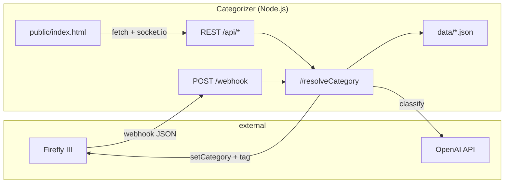

# Architecture

## Overview

**Firefly III AI Categorizer** is a single-process Node.js sidecar that automates
transaction categorization for a Firefly III instance. It sits between Firefly III
(webhook trigger) and OpenAI (classification fallback), with deterministic rule
layers that reduce API cost and improve accuracy.

### Problem

Firefly III users accumulate uncategorized withdrawal transactions. Manual
categorization is tedious; Firefly's native rules cover simple keyword cases but
not semantic matching (e.g. "REWE SAGT DANKE" → Groceries). This service adds
AI-assisted categorization with operator-configurable pre-AI rules.

### Design stance (brownfield)

The codebase is a **working fork** of bahuma20/firefly-iii-ai-categorize with
substantial feature additions. Architecture documents **what exists** and
**minimal evolution paths** — not a greenfield rewrite. per DEC-0001, DEC-0002.

### System context



### Deployment context

Production runs as the `categorizer` service in the parent Firefly Docker stack
(`/workdir/firefly/docker-compose.yml`, port 3000, Traefik). The repo-local
`docker-compose.yml` is deprecated standalone-dev only. per DEC-0002.

## Components

### 1. HTTP gateway (`src/App.js`)

Monolithic Express application (~3.3k LOC) owning:

| Concern | Implementation |
|---------|----------------|
| Route registration | ~40 endpoints (webhook, batch, mappings, extraction, duplicates) |
| Categorization orchestration | `#resolveCategory`, `#processTransaction`, batch loops |
| Job lifecycle | `JobList` + `queue` (concurrency 1) + Socket.io broadcast |
| File upload | `multer` memory storage for CSV/PDF extraction |
| Config gate | `ENABLE_UI` toggles static UI + CORS |

**Boundary:** All HTTP concerns and orchestration live here. Domain logic for
mappings and external APIs is delegated to service classes.

### 2. Categorization pipeline (`#resolveCategory`)

Single shared pipeline for webhook, bulk jobs, and test webhook. per DEC-0001.

| Step | Service | Behavior | Stops pipeline? |
|------|---------|----------|-----------------|
| 0 | App (settings) | Skip deposits if enabled | Yes (skip tx) |
| 1 | `AccountCategoryMappingService` | Hard 1:1 account→category | Yes (assign) |
| 2 | `AutoCategorizationService` | Foreign/travel heuristics | Yes (assign) |
| 3 | `WordMappingService` | Text replacement on description/payee | No (enhance) |
| 4 | `CategoryMappingService` | Keyword→AI hint (not direct assign) | No (hint) |
| 5 | `OpenAiService` | LLM classification | Yes (assign or fail) |

On AI failure: `FailedTransactionService` logs entry; no Firefly mutation.

### 3. Firefly integration (`src/FireflyService.js`)

REST client for Firefly III v1 API (PAT auth). Responsibilities:

- Read: categories, accounts, tags, transactions (paginated search/filter)
- Write: set category, add/remove tags, create/update/delete transactions
- Duplicate detection queries for maintenance UI

Uses native `fetch` (Node 18+). Errors wrapped in `FireflyException`.

### 4. OpenAI integration (`src/OpenAiService.js`)

OpenAI SDK v3 (`OpenAIApi`). Methods:

- `classify()` — category selection from description + payee + category list
- `matchAccount()` — optional account name matching for extraction flows

Rate-limit handling: exponential backoff in App (`#retryWithBackoff`, 429).
Default model: `gpt-4o-mini` (`OPENAI_MODEL` env).

Future: migrate to Structured Outputs per R-0002 / DEC-0003.

### 5. Configuration services (JSON-backed)

All persist to `data/` via `src/storage.js` (`DATA_DIR` override supported):

| Service | File | Purpose |
|---------|------|---------|
| `WordMappingService` | `word-mappings.json` | Pre-AI text substitution |
| `CategoryMappingService` | `category-mappings.json` | Keyword hints for AI |
| `AccountCategoryMappingService` | `account-category-mappings.json` | Hard account rules |
| `AutoCategorizationService` | `auto-categorization-config.json` | Foreign/travel rules |
| `FailedTransactionService` | `failed-transactions.json` | Failed attempt log (max 100) |
| `TransactionExtractionService` | `extraction-config.json` | CC statement splitter config |

Load-at-init pattern; CRUD via service methods and REST endpoints.

### 6. Job tracking (`src/JobList.js`)

In-memory `Map` of individual and batch jobs with `EventEmitter` → Socket.io.
Supports pause/resume/cancel flags on batch jobs.

**Limitation:** Job history is ephemeral — lost on container restart. Failed
transaction file persists separately.

### 7. Credit card extraction (`src/TransactionExtractionService.js`)

Parses CSV/PDF statements, creates child transactions in Firefly linked to
parent. Uses `csv-parse`, `pdf-parse`, `extractionSum.js` for totals validation.

### 8. Admin UI (`public/index.html`)

Monolithic SPA (~5.7k lines): inline HTML/CSS/JS, Socket.io client, fetch to
REST API. No build step. Served when `ENABLE_UI=true`.

Panels: categorizer settings, mappings, bulk jobs, transaction management
(drag-and-drop), CC splitter, duplicate cleanup, test webhook.

### 9. Engineering overlay (its-magic)

Not a runtime dependency. Provides Cursor agent workflow, validation scripts,
CI runbook integration, and engineering docs. Version: 0.1.2-48.

## Data flow

### Webhook path

```
Firefly POST /webhook
  → validate payload (withdrawal check, deposit skip)
  → queue.add(processTransaction)  [serial]
  → #resolveCategory
  → FireflyService.setCategory + addTag
  → JobList event → Socket.io → UI
```

### Bulk path

```
POST /api/process-uncategorized | /api/process-all
  → FireflyService fetch transactions
  → JobList.createBatchJob
  → loop with pause/resume/cancel checks
  → #resolveCategory per transaction
  → progress updates via Socket.io
```

## Interfaces

### External APIs consumed

| API | Auth | Key endpoints used |
|-----|------|-------------------|
| Firefly III v1 | PAT Bearer | `/api/v1/categories`, `/api/v1/transactions`, `/api/v1/accounts`, `/api/v1/tags` |
| OpenAI | API key | Chat completions (SDK v3) |

### External APIs exposed

| Endpoint group | Consumer |
|----------------|----------|
| `POST /webhook` | Firefly III automation |
| `/api/*` | Admin UI, operator scripts |
| `GET /` | Docker health check |

API version: `GET /api/version` → `1.1.0` (constant in App.js).

### Environment contract

| Variable | Required | Default |
|----------|----------|---------|
| `FIREFLY_URL` | yes | — |
| `FIREFLY_PERSONAL_TOKEN` | yes | — |
| `OPENAI_API_KEY` | yes | — |
| `OPENAI_MODEL` | no | `gpt-4o-mini` |
| `ENABLE_UI` | no | `false` |
| `PORT` | no | `3000` |
| `FIREFLY_TAG` | no | `AI categorized` |
| `DATA_DIR` | no | `./data` |

## Non-functional requirements

| Attribute | Current state | Target |
|-----------|---------------|--------|
| Availability | Single instance, no HA | Acceptable for personal finance sidecar |
| Throughput | Queue concurrency 1 | Prevents Firefly/OpenAI rate limits |
| Security | PAT + API key in env; non-root Docker user | No secrets in `data/` |
| Observability | console.log + Socket.io UI | No APM; structured logging is future work |
| Testability | No unit tests in repo | Add harness per runbook (blocked on TEST_COMMAND) |
| Privacy | Tx description/payee sent to OpenAI | Documented in README |

## Risks

| ID | Risk | Likelihood | Impact | Mitigation |
|----|------|------------|--------|------------|
| R1 | `App.js` monolith — changes have wide blast radius | High | Medium | Service extraction only when tests exist; per DEC-0004 |
| R2 | In-memory jobs lost on restart | Medium | Low | Failed-tx file persists; UI shows empty job list after restart |
| R3 | OpenAI cost spikes on bulk "process all" | Medium | Medium | Pre-AI layers, rate-limit backoff, batch pause/cancel |
| R4 | Invalid AI category name (not in Firefly list) | Medium | Low | Validation against `categories` Map before assign |
| R5 | Firefly API pagination gaps in bulk fetch | Low | Medium | FireflyService uses paginated loops; monitor error logs |
| R6 | No automated test suite | High | High | Bootstrap `tests/run-tests.ps1` or shell equivalent in sprint 1 |
| R7 | Privacy — transaction data sent to OpenAI | Certain | Medium | Operator consent via README; optional skip-deposits |
| R8 | JSON file corruption in `data/` | Low | High | Docker volume backups; services should handle parse errors gracefully |
| R9 | OpenAI SDK v3 deprecation | Medium | Medium | Plan migration path per DEC-0003 |

## Decisions

| ID | Summary | Status |
|----|---------|--------|
| DEC-0001 | Unified `#resolveCategory` pipeline for all entry points | Accepted |
| DEC-0002 | Production deploy via parent Firefly Docker stack | Accepted |
| DEC-0003 | Defer OpenAI Structured Outputs migration | Accepted |
| DEC-0004 | Retain JSON file persistence; no database | Accepted |

Full records: `decisions/DEC-0001.md` … `decisions/DEC-0004.md`.

## Evolution paths (not in scope now)

1. **Extract route modules** from App.js (webhook, batch, extraction, admin)
2. **Structured Outputs** for OpenAI classify (R-0002)
3. **Persistent job store** (SQLite or Redis) for restart-safe batch progress
4. **Test harness** — unit tests for pipeline steps with mocked Firefly/OpenAI
5. **TypeScript migration** — low priority unless team grows

## Documentation map

| Audience | Location |
|----------|----------|
| Operators / users | `README.md`, `docs/*_GUIDE.md` |
| Engineering | `docs/engineering/codebase-map.md`, this file |
| Spec-pack (per story) | `docs/engineering/spec-pack/` — created at intake |
| User guides (per story) | `docs/user-guides/US-xxxx.md` — created at intake |

## Codebase map lifecycle (US-0082)

Bootstrap and refresh: `python scripts/materialize_codebase_map.py --trigger architecture`.
Full analysis: `/map-codebase`. Map artifact: `docs/engineering/codebase-map.md`.

# BUG-0001

Category dropdown JSON parse error when Firefly returns HTML instead of JSON:API.
Scoped fix per **DEC-0005** and **R-0007** — harden `FireflyService.getCategories()`
only; defer shared `#fetchJson` helper until after US-0001 test harness.

## Problem and blast radius

| Layer | Current failure | User impact |
|-------|-----------------|-------------|
| `FireflyService.getCategories()` | Bearer only; blind `response.json()` on any body | `SyntaxError: Unexpected token <` when Firefly/proxy returns HTML |
| `App.js #getCategories` | Forwards `error.message` verbatim | Misleading parse jargon in API `{ error }` |
| `public/index.html` loaders | Generic "Failed to load categories" | Keyword-mapping and account-mapping `<select>` empty on page load |

**In scope:** `GET /api/categories` proxy path and page-load dropdown loaders
(`loadCategoriesForKeywordMappings`, `loadAccountsAndCategoriesForAccountMappings`).

**Out of scope:** Pattern A/B sibling methods (`getTags`, `getTransaction`, etc.)
— follow-up story after US-0001 (R-0007 audit table).

## Error contract — `GET /api/categories`

Our API always responds with JSON (Express `res.json`). Contract:

### Success (HTTP 200)

```json
{
  "success": true,
  "categories": ["Groceries", "Transport", "..."]
}
```

- `categories`: sorted array of category **names** (strings), derived from
  `FireflyService.getCategories()` Map keys.
- Empty Firefly category list → `{ success: true, categories: [] }` (UI shows
  "No categories found").

### Structured failure (HTTP 200 — preserve existing UI fetch pattern)

```json
{
  "success": false,
  "error": "<operator-actionable message>"
}
```

- `error` must **never** be a raw `SyntaxError` / `Unexpected token <` string.
- Source priority in `#getCategories` catch block:
  1. `FireflyException.message` (already includes status + body snippet for HTTP errors)
  2. Guard-thrown `FireflyException` for non-JSON bodies (see below)
  3. Generic fallback: `"Failed to load categories from Firefly III"`

**Optional (not required for acceptance):** map upstream Firefly misconfiguration to
HTTP **502** with same JSON body. Default remains 200 + `{ success: false }` to avoid
breaking existing UI `fetch` + `r.json()` flow.

## `getCategories()` guard specification

Copy **pattern C** from `createTransactions` / `updateTransactions` (R-0007).
Do **not** introduce a shared helper in this bug fix (DEC-0005).

### Request headers

```javascript
headers: {
  Authorization: `Bearer ${this.#PERSONAL_TOKEN}`,
  Accept: 'application/json',
}
```

- `Accept: application/json` satisfies Firefly docs (R-0001, R-0007); matches
  existing repo convention on POST paths.
- Alternative `application/vnd.api+json` is valid but unnecessary for this fix.

### Response handling (after `response.ok` check)

1. Read `content-type` header (lowercase).
2. If `content-type` includes `json`:
   - `return await response.json()` then build Map as today.
3. Else (HTML, plain text, empty):
   - Read body as text (once).
   - Optional trim heuristic: if trimmed body starts with `{` or `[`, attempt
     `JSON.parse` (proxy header mismatch); on success, proceed.
   - Otherwise throw:

```javascript
throw new FireflyException(
  response.status,
  response,
  `Non-JSON response from Firefly (check FIREFLY_URL and PAT): ${text.substring(0, 500)}`
);
```

- Message must mention **FIREFLY_URL** and **PAT** (align `#getUncategorizedByType`
  parse-catch copy per R-0007).
- Existing `!response.ok` path unchanged: `FireflyException(status, response, await response.text())`.

### `#getCategories` proxy (`App.js`)

No route signature change. Ensure catch uses `error.message` from `FireflyException`
(actionable after guard). Log full error server-side; return trimmed message to client.

## Optional UI error surfacing (`public/index.html`)

Acceptance requires structured backend errors; UI polish is optional within BUG-0001.

| Function | Element | Current | Target (optional) |
|----------|---------|---------|-------------------|
| `loadCategoriesForKeywordMappings` | `#mappingTargetCategory` | `"Failed to load categories"` | Use `j.error` when `!j.success` before throw; set option text to truncated backend message |
| `loadAccountsAndCategoriesForAccountMappings` | `#acmTargetCategory` | `"Failed to load categories"` | When `!catJson.success`, set option from `catJson.error`; keep account path independent |

Implementation sketch:

```javascript
if (!j.success) {
  const msg = j.error || 'Failed to load categories';
  mappingTargetCategory.innerHTML = `<option value="">${escapeHtml(msg)}</option>`;
  return;
}
```

- Do not `console.error` raw parse exceptions on happy-path misconfiguration (guard
  prevents client-side parse failure; our API JSON is always valid).
- Truncate displayed error to ~120 chars for dropdown width.

## Risks

| ID | Risk | Likelihood | Impact | Mitigation |
|----|------|------------|--------|------------|
| B1 | Fix only `getCategories()` — sibling methods still blind-parse HTML | High | Low (out of scope) | Follow-up story post-US-0001; document in sprint handoff |
| B2 | Firefly returns 200 HTML with misleading `content-type` | Medium | Medium | Trim heuristic + 500-char body snippet in `FireflyException` |
| B3 | Regression in webhook/batch paths that call `getCategories()` internally | Low | Medium | Same guard benefits all callers; manual smoke on test webhook |
| B4 | No automated tests (R6) | High | Medium | Manual checklist below until US-0001 |
| B5 | Operator env misconfiguration persists after code fix | Medium | Low | Error copy points to `FIREFLY_URL` / PAT; deployment verify in execute |

## Test approach

**Automated:** None until US-0001. Do not block BUG-0001 on test harness.

**Manual checklist (execute / QA):**

1. **Healthy Firefly:** Load admin UI → keyword-mapping and account-mapping category
   dropdowns populate with Firefly category names.
2. **Bad `FIREFLY_URL`:** Point at HTML-serving host → `GET /api/categories` returns
   `{ success: false, error: "...check FIREFLY_URL..." }`; no `Unexpected token <` in
   browser console.
3. **Invalid PAT:** Expired/wrong token → structured error (401 body or non-JSON guard).
4. **Empty categories:** Firefly instance with zero categories → `{ success: true, categories: [] }`.
5. **Regression:** Test webhook and bulk job still resolve categories when Firefly healthy.

## Linked artifacts

| ID | Role |
|----|------|
| DEC-0005 | Scoped `getCategories()`-only fix |
| R-0007 | FireflyService audit + pattern C reference |
| R-0001, R-0006 | Accept header + symptom chain |
| `docs/product/acceptance.md` | BUG-0001 acceptance rows |

# US-0001

Bootstrap automated test harness for `#resolveCategory` precedence regression and
CI/local quality gates. per **DEC-0006** (Option A injectable-deps factory) and
**R-0008** (`node:test` + ESM, `node --test tests/` on Node 18).

## Goal and scope

| In (AC-1–AC-5) | Out (scope_out) |
|----------------|-----------------|
| `tests/run-tests.sh` (Linux primary) | Live Firefly/OpenAI E2E |
| `tests/resolveCategory.test.js` — ≥4 precedence cases | `App.js` route extraction |
| Runbook `TEST_COMMAND` + `npm test` delegation | Browser/UI tests |
| CI `checks` job runs `TEST_COMMAND` | Option B pipeline extraction |

**Unblocks:** US-0003 (Structured Outputs regression), US-0004 (history pipeline tests).

## Test seam specification (DEC-0006)

Private `#resolveCategory` is not callable from external test files. Minimal
production surface on `App` — no env gates, no HTTP bootstrap.

### `App.createForTest(deps)`

Static factory inside `App` class body. Creates `new App()` **without** calling
`run()` (avoids Express/Socket.io/Firefly init). Assigns injected deps to private
fields before any pipeline invocation.

```javascript
static createForTest(deps = {}) {
  const app = new App();
  if (deps.openAi != null) app.#openAi = deps.openAi;
  if (deps.accountCategoryMappingService != null)
    app.#accountCategoryMappingService = deps.accountCategoryMappingService;
  if (deps.autoCategorizationService != null)
    app.#autoCategorizationService = deps.autoCategorizationService;
  if (deps.wordMapping != null) app.#wordMapping = deps.wordMapping;
  if (deps.categoryMappingService != null)
    app.#categoryMappingService = deps.categoryMappingService;
  return app;
}
```

- **Deps contract:** plain objects with the same method names production services
  expose (`categorizeTransaction`, `autoCategorize`, `applyMappings`, `getAiHint`,
  `classify`). Use `t.mock.fn()` stubs from `node:test` — no `mock.module`.
- **Default:** omitted deps leave `undefined` private fields; precedence tests must
  inject all services touched by the case under test.
- **Not injected:** `FireflyService` (not used in `#resolveCategory`), `#retryWithBackoff`
  (production impl; stub `classify()` to resolve on first call).

### `App.resolveCategoryForTest(transaction, categories)`

Thin async wrapper delegating to `#resolveCategory`. Sole external entry for unit
tests.

```javascript
async resolveCategoryForTest(transaction, categories) {
  return this.#resolveCategory(transaction, categories);
}
```

- **Naming:** `_ForTest` suffix signals test-only intent; no separate export file.
- **Alternative rejected:** Option B (`CategorizationPipeline.js`) — deferred post-harness
  (DEC-0006).

## Test harness layout

```
tests/
├── run-tests.sh              # AC-1: canonical Linux runner (executable)
├── run-tests.ps1             # AC-3 optional: Windows parity (document in runbook)
├── resolveCategory.test.js   # AC-2: precedence matrix (≥4 cases)
└── fixtures/
    ├── categories.js         # Shared categories Map factory
    ├── transactions.js       # Firefly-shaped transaction builders
    └── stubs.js              # Default service stub factories (t.mock.fn helpers)
```

| File | Responsibility |
|------|----------------|
| `run-tests.sh` | `set -euo pipefail`; `cd` to repo root; `exec node --test tests/` |
| `resolveCategory.test.js` | `import { test } from 'node:test'`; `import assert from 'node:assert/strict'`; `import App from '../src/App.js'` |
| `fixtures/categories.js` | `makeCategoriesMap()` → `Map` with `Groceries`, `Travel & Foreign`, `Restaurants`, `Utilities` (string ids) |
| `fixtures/transactions.js` | `makeWithdrawalTx({ description, destinationName, sourceId, currency, foreignAmount, … })` |
| `fixtures/stubs.js` | `makeOpenAiStub({ category })`, `makeAccountMappingStub({ category, accountId })`, `makeAutoCatStub({ category })`, no-op word/category mapping stubs |

**POC cleanup:** Remove `tests/_poc/` after execute if still present.

### Runner and operator wiring

| Surface | Target value |
|---------|--------------|
| `tests/run-tests.sh` | `#!/usr/bin/env bash` + `node --test tests/` (directory path — **no** `**` glob on Node 18; per R-0008) |
| `package.json` `scripts.test` | `bash tests/run-tests.sh` (or `./tests/run-tests.sh` with `chmod +x`) |
| `docs/engineering/runbook.md` `TEST_COMMAND` | Linux: `bash tests/run-tests.sh`; document Windows: `powershell -ExecutionPolicy Bypass -File tests/run-tests.ps1` (AC-3 dual-runner) |
| `.github/workflows/ci.yml` `checks` | Already reads `TEST_COMMAND` from runbook — no workflow change when runbook updated (AC-5) |

**Failure UX (vision):** assert messages name precedence case id (e.g. `case-2-auto-cat-wins`)
and `expected` vs `actual` category — not stack traces alone.

## AC-2 precedence matrix

Fixed order per DEC-0001 / `#resolveCategory` (~1098–1167). Cases 1–4 **required**;
5–6 optional stretch.

| Case ID | Setup | Expected winner | Key assertions |
|---------|-------|-----------------|----------------|
| **case-1-account-wins** | Account stub → `Groceries`; auto stub → `Travel & Foreign`; AI stub → `Restaurants` | Account mapping (`Groceries`) | `result.category === 'Groceries'`; `result.autoRule === 'account_category_mapping'` |
| **case-2-auto-cat-wins** | No account match; tx with `foreign_amount` or non-native `currency_code`; auto stub → `Travel & Foreign`; AI stub → `Restaurants` | Auto-cat (`Travel & Foreign`) | `result.category === 'Travel & Foreign'`; `classify` **not called** |
| **case-3-ai-wins** | Account + auto return `null`; AI stub → `Restaurants` | AI (`Restaurants`) | `result.category === 'Restaurants'`; `classify` called once with mapped description args |
| **case-4-account-beats-ai** | Account stub → `Groceries`; AI stub → `Restaurants` (would win if reached) | Account mapping (`Groceries`) | `result.category === 'Groceries'`; `classify.mock.callCount() === 0` |
| case-5-stale-mapping (optional) | Account stub → `Deleted Category` (absent from `categories` Map); auto stub → `Travel & Foreign` | Fall through to auto-cat | `result.category === 'Travel & Foreign'`; warns in stderr (optional `t.capture` check) |
| case-6-ai-invalid (optional) | No account/auto; AI stub → `Nonexistent` (absent from Map) | `{ category: null, … }` | `result.category === null`; prompt/response preserved from stub |

### Stub wiring per case

| Dependency | case-1 | case-2 | case-3 | case-4 |
|------------|--------|--------|--------|--------|
| `accountCategoryMappingService.categorizeTransaction` | returns Groceries match | `null` | `null` | returns Groceries match |
| `autoCategorizationService.autoCategorize` | returns Travel (ignored) | returns Travel match | `null` | `null` |
| `openAi.classify` | stub Restaurants (ignored) | stub Restaurants (ignored) | stub Restaurants | stub Restaurants (not called) |
| `wordMapping.applyMappings` | identity passthrough | identity | identity | identity |
| `categoryMappingService.getAiHint` | `null` | `null` | `null` | `null` |
| Transaction fixture | generic withdrawal | `foreign_amount: 10` or `currency_code: 'USD'` (non-native) | generic withdrawal | generic withdrawal |

**case-2 transaction note:** auto stub returns match; real `AutoCategorizationService` would
also match on `foreign_amount` — stubs isolate precedence from config file races (R-0008).

## Mock fixtures reference

### `categories` Map

```javascript
// fixtures/categories.js
export function makeCategoriesMap(overrides = new Map()) {
  const base = new Map([
    ['Groceries', '1'],
    ['Travel & Foreign', '2'],
    ['Restaurants', '3'],
    ['Utilities', '4'],
  ]);
  for (const [k, v] of overrides) base.set(k, v);
  return base;
}
```

### Transaction shape (Firefly webhook lookalike)

```javascript
// fixtures/transactions.js
export function makeWithdrawalTx({
  description = 'REWE SAGT DANKE',
  destinationName = 'REWE',
  sourceId = '42',
  sourceName = 'Checking',
  currencyCode = 'EUR',
  foreignAmount = null,
} = {}) {
  return {
    attributes: {
      transactions: [{
        type: 'withdrawal',
        description,
        destination_name: destinationName,
        source_id: sourceId,
        source_name: sourceName,
        currency_code: currencyCode,
        foreign_amount: foreignAmount,
      }],
    },
  };
}
```

### Service stubs

```javascript
// fixtures/stubs.js — use with test context t.mock.fn()
export function makeOpenAiStub({ category = 'Restaurants', prompt = 'p', response = 'r' } = {}) {
  return {
    classify: async () => ({ category, prompt, response }),
  };
}

export function makeAccountMappingStub({ category, accountId = '42', accountName = 'Checking' } = {}) {
  return {
    categorizeTransaction: () => category ? {
      category,
      reason: 'test account mapping',
      autoRule: 'account_category_mapping',
      mappingName: 'test-mapping',
      accountName,
      accountId,
    } : null,
  };
}

export function makeAutoCatStub({ category = 'Travel & Foreign' } = {}) {
  return {
    autoCategorize: () => category ? {
      category,
      reason: 'test auto-cat',
      autoRule: 'foreign_flag',
    } : null,
  };
}

export function makePassthroughWordMapping() {
  return { applyMappings: (text) => text };
}

export function makeNoHintCategoryMapping() {
  return { getAiHint: () => null };
}
```

- **Prefer stubs over real services** for AC-2 required cases — avoids async
  `loadMappings()` / `loadConfig()` constructor races (R-0008).
- **Temp `DATA_DIR`:** viable for optional integration-style cases; not required for AC-2.

## Risks

| ID | Risk | Likelihood | Impact | Mitigation |
|----|------|------------|--------|------------|
| T1 | Test-only API on production `App` | Low | Low | Explicit `*ForTest` naming; minimal LOC (~15–25) |
| T2 | Node 18 glob pitfall in runner | Medium | High | `node --test tests/` only — document in runbook (R-0008) |
| T3 | Async service constructor races if real instances used | Medium | Medium | Default to stub deps in precedence tests |
| T4 | `npm test` / runbook drift | Medium | Medium | Single canonical `run-tests.sh`; runbook + package.json updated together |
| T5 | CI passes with missing `TEST_COMMAND` | Low | High | Runbook must set non-empty `TEST_COMMAND` before merge (AC-5) |
| T6 | Option B scope creep mid-sprint | Low | Medium | DEC-0006 locks Option A |

## Linked artifacts

| ID | Role |
|----|------|
| DEC-0001 | Pipeline precedence order |
| DEC-0003 | Harness unblocks Structured Outputs |
| DEC-0006 | Option A test seam |
| R-0008 | node:test ESM + runner invocation |
| `docs/product/acceptance.md` | AC-1 through AC-5 |
| `docs/engineering/spec-pack/US-0001-crs.md` | CRS scope |
| `docs/product/vision.md` | Test harness operator UX |
| `handoffs/po_to_tl.md` | Discovery mock matrix |

# US-0002

Product and user documentation alignment — docs-only vertical slice with no
runtime/API changes. per **DEC-0007** (validator brownfield policy), **DEC-0008**
(surgical refresh + reference-map guide + minimal vision sync), and research
**R-0010–R-0013**.

## Goal and scope

| In (AC-1–AC-4) | Out (scope_out) |
|----------------|-----------------|
| Surgical `docs/CODEBASE_ANALYSIS.md` refresh (R-0011) | Marketing, translations |
| `docs/user-guides/US-0002.md` operator documentation map (R-0012) | Runtime/API code (`src/`, `public/`) |
| README feature coverage green with `--no-template-parity` (DEC-0007, R-0013) | Full `template/` materialization |
| Vision/README pipeline terminology consistency (AC-4) | Duplicating README feature prose in user guide |

**User guide path:** `docs/user-guides/US-0002.md` (create at execute; reference map pattern).

**Unblocks:** US-0003 (docs gates green); operator trust in doc surfaces before AI SDK migration.

## Design assumption challenges

| Decision | Alternative considered | Verdict | Reference |
|----------|------------------------|---------|-----------|
| Validator brownfield policy | Materialize `template/`; lib-direct audit; disable enforce | **DEC-0007** — `--no-template-parity` + minimal installer | R-0010 |
| CODEBASE_ANALYSIS strategy | Full rewrite | **Surgical edits** — five known drift rows only | R-0011, DEC-0008 |
| User guide shape | Feature how-to duplicating README | **Reference map** — Diátaxis index layer | R-0012, DEC-0008 |
| AC-4 vision sync | Numbered pipeline diagram in vision | **Minimal cross-ref** — README owns diagram; doc map bridges | R-0011, DEC-0008 |
| Story decomposition | Split analysis vs README/guide | **Single story** — partial delivery leaves gates red | PO handoff |

## AC-1 — CODEBASE_ANALYSIS refresh architecture

**Strategy:** Targeted section edits preserving existing doc structure (Overview,
Backend Components, Enhanced Features, Docker). Cross-link README § Categorization
Process Flow rather than duplicating ASCII art.

| Drift row (R-0009) | Target location | Canonical source |
|--------------------|-----------------|------------------|
| GPT-3.5-turbo-instruct | § OpenAiService.js | `package.json`, README env table → **gpt-4o-mini** |
| 4-step pipeline / wrong step 1 | § Multi-Stage Categorization | DEC-0001 5-step order; **Account → Category Mappings** terminology |
| Missing mapping services | § Backend Components (new bullets) | `AccountCategoryMappingService`, `CategoryMappingService`, `WordMappingService`, `AutoCategorizationService` |
| No API version | § App.js API endpoints | `GET /api/version`, `apiVersion: 1.1.0`, enrich/refresh |
| No test harness | New § Quality / test harness | vision § Test harness, runbook `TEST_COMMAND` |

**Verification:** Maintainer can trace pipeline order from analysis doc to README
diagram and `#resolveCategory` without contradictions.

## AC-2 — Validator and coverage architecture

### Brownfield validator path (DEC-0007)

| Prerequisite | Action |
|--------------|--------|
| Missing `installer` module | Vendor minimal `scripts/installer.py` with `merge_scratchpad_layers(repo_root)` (DEC-0055) |
| Missing `template/` tree | Always pass `--no-template-parity` on blocking invocations |

**Canonical enforce command:**

```bash
python scripts/validate_readme_feature_coverage.py --no-template-parity --report
```

**Lib-direct audit** (sprint dev only, not AC-2 literal):

```bash
PYTHONPATH=scripts python3 -c "import readme_feature_coverage_lib as rfc; ..."
```

### Post-DONE coverage predicate (R-0013)

When US-0002 flips `DONE` + `user_visible: true`, affinity requires:

| Surface | Required addition |
|---------|-------------------|
| `its_magic/README.md` | `## Other useful capabilities` H2 with **US-0002** / doc map bullet |
| `docs/developer/README.md` § Quality gates | Traceability line: `- **US-0002** — operator documentation map; see docs/user-guides/US-0002.md` |

**While OPEN:** `coverage_total=0`, report PASS — no premature FAIL.

## AC-3 — Operator documentation map architecture

**Pattern:** Reference/navigation layer (Diátaxis) — answers "where do I look?" per
`docs/user-guides/README.md` required schema.

| Section | Content boundary |
|---------|------------------|
| Purpose | Navigation hub; not feature manual |
| Prerequisites | Firefly + categorizer + PAT (link README § Installation) |
| Usage steps | Lookup workflow: identify task → open linked guide → cross-check gates |
| Example | Scenario table (e.g. bulk precedence → `BULK_CATEGORIZATION_GUIDE.md`) |
| Limitations | Map ≠ README; legacy guides may lag; English only |
| Troubleshooting | Doc vs behavior → README § Troubleshooting + `CODEBASE_ANALYSIS.md` |

**Core link table** (execute copies from vision § Documentation UX):

| Operator need | Canonical surface |
|---------------|-------------------|
| Setup, env, webhook | `README.md` § Installation |
| Pipeline order (5 steps) | `README.md` § Categorization Process Flow |
| Bulk / precedence | `docs/BULK_CATEGORIZATION_GUIDE.md` |
| Auto-cat / foreign travel | `docs/AUTO_CATEGORIZATION_GUIDE.md` |
| Word + keyword mappings | `docs/WORD_MAPPING_GUIDE.md` |
| Transaction drag-drop UI | `docs/TRANSACTION_MANAGEMENT_GUIDE.md` |
| Docker production | `docs/DOCKER_GUIDE.md` |
| Duplicate cleanup | `docs/DUPLICATE_CLEANUP_GUIDE.md` |
| Product narrative | `docs/product/vision.md` |
| Maintainer architecture | `docs/CODEBASE_ANALYSIS.md` |
| Tests / quality gates | `docs/engineering/runbook.md`, `docs/developer/README.md` |

**Anti-patterns (reject):** Copying README Key Features or pipeline diagram; restating
DEC-0001 as tutorial steps; duplicating spec-pack or architecture prose.

## AC-4 — Vision/README consistency architecture

| Surface | Owner | US-0002 action |
|---------|-------|----------------|
| Numbered 5-step pipeline | README § Categorization Process Flow | No change required if terminology aligned |
| Product narrative / IA | `docs/product/vision.md` | Terminology pass: **Account → Category Mappings** as step 1 |
| Operator navigation | `docs/user-guides/US-0002.md` | Link table satisfies "where is the pipeline?" |
| Optional | vision § Documentation alignment | One-line cross-ref to README pipeline section |

**Already aligned post-US-0001:** runbook `TEST_COMMAND` (`bash tests/run-tests.sh`) matches
vision § Test harness — verify only, no edit expected.

## Execute sequencing (dependency order)

```
T-installer → T-analysis → T-user-guide → T-readme-coverage → T-vision-pass → T-validator
```

| Step | Deliverable | Blocks |
|------|-------------|--------|
| 1 | `scripts/installer.py` stub | AC-2 canonical script |
| 2 | CODEBASE_ANALYSIS surgical refresh | AC-1 |
| 3 | `docs/user-guides/US-0002.md` | AC-3; R-0013 dev shard line |
| 4 | README `Other useful capabilities` + dev traceability | AC-2 post-DONE predicate |
| 5 | Vision terminology (+ optional cross-ref) | AC-4 |
| 6 | Runbook validator flag + `--report` green | AC-2 release gate |

**Sprint sizing note:** Six atomic tasks — under `SPRINT_MAX_TASKS=12`; no split required.

## Risks

| ID | Risk | Likelihood | Impact | Mitigation |
|----|------|------------|--------|------------|
| D1 | Installer stub drift vs kit contract | Low | High | Implement `merge_scratchpad_layers` per DEC-0055 only |
| D2 | Premature US-0002 DONE flip | Medium | High | R-0013 lines before backlog DONE; release gate FAIL otherwise |
| D3 | CODEBASE_ANALYSIS re-drift on US-0003/0004 | Low | Medium | Test-harness subsection cross-links runbook gates |
| D4 | User guide becomes stale link rot | Medium | Medium | Section anchors; link check at execute |
| D5 | Wrong README affinity H2 | Low | High | Add `Other useful capabilities` per R-0013 manifest — do not relocate |
| D6 | Template parity confusion | Low | Medium | Document `--no-template-parity` in runbook alongside `validate_doc_profile` note |

## Linked artifacts

| ID | Role |
|----|------|
| DEC-0007 | Brownfield validator `--no-template-parity` + installer |
| DEC-0008 | Surgical refresh + reference map + minimal vision sync |
| R-0009 | Drift audit baseline |
| R-0010 | Validator bootstrap probe |
| R-0011 | CODEBASE_ANALYSIS section plan |
| R-0012 | Doc map schema |
| R-0013 | Post-DONE README coverage |
| `docs/product/acceptance.md` | AC-1 through AC-4 |
| `docs/engineering/spec-pack/US-0002-crs.md` | CRS scope |
| `docs/engineering/spec-pack/US-0002-design-concept.md` | Design concept |
| `docs/engineering/spec-pack/US-0002-technical-specification.md` | Technical spec |
| `docs/user-guides/US-0002.md` | Operator doc map (execute) |
| `handoffs/po_to_tl.md` | Discovery operator map |

# US-0003

OpenAI Structured Outputs migration — SDK v4 upgrade with schema-locked `classify()`
only. per **DEC-0009** (injectable client test seam), **DEC-0010** (partial v4
migration policy), and research **R-0015–R-0017**. Implements deferred scope from
**DEC-0003** (unblocked by US-0001/S0003).

## Goal and scope

| In (AC-1–AC-5) | Out (scope_out) |
|----------------|-----------------|
| `OpenAiService.classify()` → `json_schema` + runtime enum + `UNKNOWN` | Fine-tuning, multi-provider LLM |
| `openai@^4` ESM client (`maxRetries: 0`) shared by all methods | Structured Outputs on `matchAccount` / `extractTransactionsFromText` |
| Preserve `{ category, prompt, response }` external contract | Prompt UI / operator workflow changes |
| `tests/openAiService.test.js` (mock client, no live API) | Live OpenAI integration tests in CI |
| `tests/resolveCategory.test.js` 4/4 unchanged (stub seam) | `App.js` / `#retryWithBackoff` changes |

**Operator impact:** None (`user_visible: false`). Happy-path categorization outcomes
unchanged; failed-tx queue behavior preserved for null/UNKNOWN/refusal.

**Unblocks:** US-0004 confidence-shape extension (adjacent; not in AC).

## Design assumption challenges

| Decision | Alternative considered | Verdict | Reference |
|----------|------------------------|---------|-----------|
| SDK target | Jump to openai v5/v6 | **`openai@^4`** — POC on 4.104.0; limit blast radius | R-0015, DEC-0010 |
| Schema enforcement | `json_object` mode only | **`json_schema` + `strict: true`** — required for AC-2 | R-0016 |
| Schema authoring | Zod + `zodResponseFormat` | **Manual JSON Schema** — no new dep; `parse()` unavailable in v4.104 | R-0014, R-0016 |
| Enum validation | Keep post-hoc `indexOf` | **Remove** — schema guarantees enum membership | R-0016, AC-2 |
| 429 retry owner | SDK default retries (2×) | **`maxRetries: 0`** — `#retryWithBackoff` sole policy | R-0015, AC-5 |
| Unit test seam | `mock.module('openai')` | **Injectable `client`** via `createForTest` | R-0017, DEC-0009 |
| Schema builder location | Separate module file | **Private `#buildCategorySchema()`** in `OpenAiService.js` | Simplicity gate |
| Sibling methods | Full Structured Outputs on all 3 | **v4 call-path only** — legacy prompt+parse | DEC-0010, scope_out |
| `OpenAiException` export | Export class for tests | **Module-private** — assert `err.code === 429` on caught error | R-0017 |

## Component architecture

### Mutation surface (single file primary)

| Symbol | Location | Change |
|--------|----------|--------|
| Constructor | `src/OpenAiService.js` ~14–28 | v3 `Configuration`/`OpenAIApi` → v4 `OpenAI({ apiKey, maxRetries: 0 })`; optional `deps.client` |
| `static createForTest(deps)` | `src/OpenAiService.js` (new) | `return new OpenAiService(deps)` — mirrors `App.createForTest` (DEC-0009) |
| `classify()` | ~101–185 | `chat.completions.create` + `response_format`; parse JSON; UNKNOWN/refusal → null |
| `#buildCategorySchema(categories)` | (new private) | Runtime enum `[...categories.filter(Boolean), 'UNKNOWN']` |
| `#generatePrompt()` | ~187–208 | Slim system message; keep category list + `suggestedCategory` in user prompt |
| `matchAccount()` | ~30–99 | v4 API path + response shape only; **no schema** |
| `extractTransactionsFromText()` | ~238–263 | v4 API path + response shape only; **no schema** |
| `OpenAiException` | ~271–283 | Map v4 `OpenAI.APIError.status` → `this.code` |
| `package.json` | `dependencies.openai` | `^3.2.1` → `^4` |

### Caller boundary (unchanged)

| Caller | Contract |
|--------|----------|
| `App.js #resolveCategory` ~1118–1187 | `classify(categoryNames, mappedDestinationName, mappedDescription, transactionType, classifyOptions)` |
| `App.js #retryWithBackoff` ~1190–1204 | Retries when `error.code === 429`; **no edits** |
| `categories.has(aiResult.category)` ~1172 | Double-check Map membership after classify |

## AC-1 / AC-2 — Structured Outputs specification

### Schema builder (`#buildCategorySchema`)

```javascript
#buildCategorySchema(categories) {
  const enumValues = [...categories.filter(Boolean), 'UNKNOWN'];
  return {
    type: 'object',
    properties: {
      category: {
        type: 'string',
        enum: enumValues,
        description: 'Exact category name from the provided list, or UNKNOWN if none fits',
      },
    },
    required: ['category'],
    additionalProperties: false,
  };
}
```

### Request shape (`classify()` only)

```javascript
const response = await this.#openAi.chat.completions.create({
  model: this.#model,
  messages: [
    { role: 'system', content: 'You categorize financial transactions. Choose the best category or UNKNOWN.' },
    { role: 'user', content: prompt },
  ],
  temperature: 0.1,
  max_tokens: 50,
  response_format: {
    type: 'json_schema',
    json_schema: {
      name: 'transaction_category',
      strict: true,
      schema: this.#buildCategorySchema(categories),
    },
  },
});
```

- **`strict: true` + `additionalProperties: false`** — API rejects out-of-enum values (AC-2).
- **Enum built per call** from Firefly `categoryNames` argument — no static schema file.
- **Size gate:** <50 categories → ~178–2500 chars schema; well under 500 enum / 15k char API limits (R-0016).

### Response mapping (external contract preserved)

| API outcome | Return value |
|-------------|--------------|
| `parsed.category === 'UNKNOWN'` | `{ category: null, response: 'UNKNOWN', prompt }` |
| Valid enum (not UNKNOWN) | `{ category: guess, response: guess, prompt }` |
| `message.refusal` set | `{ category: null, response: refusal, prompt }` |
| JSON parse failure (defensive) | `{ category: null, response: rawContent, prompt }` + `console.warn` |

- **Remove** post-hoc `categories.indexOf(guess)` — schema enforcement replaces it (AC-2).
- **Caller guard** `categories.has(aiResult.category)` in `App.js` remains for Map staleness edge case.

## AC-4 — Model selection

| Model | `supportedModels` allowlist | Structured Outputs `classify()` |
|-------|----------------------------|--------------------------------|
| `gpt-4o-mini` | ✓ default | ✓ |
| `gpt-4o` | ✓ | ✓ |
| `gpt-3.5-turbo` | ✓ (unchanged) | ✗ API 400 on `json_schema` |

- **`OPENAI_MODEL` env + `setModel()` allowlist preserved** — no snapshot suffixes required (`gpt-4o-mini` alias resolves per OpenAI).
- **`gpt-3.5-turbo` classify breakage acceptable** — README recommends `gpt-4o-mini`; optional `console.warn` when model lacks Structured Outputs support (execute polish, not AC).

## AC-5 — Error handling and retry policy

### SDK client config

```javascript
this.#openAi = deps.client ?? new OpenAI({ apiKey, maxRetries: 0 });
```

- Disables SDK built-in 429 retry (default 2) so `#retryWithBackoff` remains authoritative.

### v4 error mapping (`classify()`)

```javascript
} catch (error) {
  if (error instanceof OpenAI.APIError) {
    const status = error.status;
    if (status === 429) { this.#stats.rateLimitHits++; throw new OpenAiException(status, error, '...'); }
    if (status === 401) { throw new OpenAiException(status, error, '...'); }
    if (status === 400) { throw new OpenAiException(status, error, error.message); }
    throw new OpenAiException(status, error, error.message);
  }
  throw new OpenAiException(null, null, `Network error: ${error.message}`);
}
```

- **`OpenAiException.code = status`** — preserves `error.code === 429` check in `#retryWithBackoff`.
- **429/401/400 throw paths unchanged** in behavior; only error object shape migrates from axios to `APIError`.

## Partial migration — sibling methods (DEC-0010)

| Method | v4 change | Schema | Follow-up |
|--------|-----------|--------|-----------|
| `matchAccount()` | `chat.completions.create`; drop `.data` | None | Tech debt: prompt+parse reliability |
| `extractTransactionsFromText()` | Same | None | Tech debt: `#safeExtractJson` parse path |

Shared constructor means import/init update applies to all three even though only
`classify()` gets Structured Outputs. Document in sprint handoff; no separate story.

## Test architecture

### Layer 1 — Unit (`tests/openAiService.test.js`, new)

Injectable mock client per **DEC-0009** / **R-0017**:

```javascript
const createMock = t.mock.fn(async () => ({ choices: [{ message: { content: '{"category":"Groceries"}' } }] }));
const svc = OpenAiService.createForTest({
  client: { chat: { completions: { create: createMock } } },
});
```

| Case ID | Assert |
|---------|--------|
| **oai-1-schema-enum** | Captured `response_format.json_schema.schema.properties.category.enum` === `[...categories, 'UNKNOWN']`; `strict: true` |
| **oai-2-valid-category** | `{ category: 'Groceries', response: 'Groceries', prompt }` |
| **oai-3-unknown-null** | Enum `UNKNOWN` → `{ category: null, response: 'UNKNOWN', prompt }` |
| **oai-4-refusal** | `message.refusal` → `{ category: null, response: refusal, prompt }` |
| **oai-5-429-exception** | Mock reject `OpenAI.APIError(429, …)` → thrown `.code === 429` |
| oai-6-hint (optional) | `suggestedCategory` appears in user prompt |

- Picked up by existing `node --test tests/` — no runner change.
- No `OPENAI_API_KEY` in CI.

### Layer 2 — Regression (`tests/resolveCategory.test.js`, unchanged)

- 4 precedence cases stub `openAi: { classify }` plain object via `App.createForTest`.
- Internal SDK migration **invisible** to App tests (AC-3).
- Gate: `bash tests/run-tests.sh` exit 0 with **4/4 + new unit tests**.

## Execute sequencing (dependency order)

```
T-sdk-pin → T-client-init → T-classify-schema → T-sibling-v4 → T-unit-tests → T-regression-gate
```

| Step | Deliverable | Blocks |
|------|-------------|--------|
| 1 | `package.json` `openai@^4` + `npm install` | All v4 imports |
| 2 | Constructor + `createForTest` + `OpenAiException` v4 mapping | Unit tests |
| 3 | `#buildCategorySchema` + `classify()` Structured Outputs | AC-1, AC-2 |
| 4 | `matchAccount` + `extractTransactionsFromText` v4 call path | Shared client smoke |
| 5 | `tests/openAiService.test.js` (cases oai-1–oai-5) | AC coverage |
| 6 | Full `bash tests/run-tests.sh` green | AC-3 release gate |

**Sprint sizing note:** Six atomic tasks — under `SPRINT_MAX_TASKS=12`; no split required.

## Risks

| ID | Risk | Likelihood | Impact | Mitigation |
|----|------|------------|--------|------------|
| O1 | Constructor shared by 3 methods — partial migration regression | Medium | Medium | Unit tests + unchanged resolveCategory stubs; manual smoke on extraction path optional |
| O2 | SDK + app double-retry on 429 | Medium | High | `maxRetries: 0` on client (DEC-0010) |
| O3 | `gpt-3.5-turbo` classify 400 | Low | Low | Default `gpt-4o-mini`; document in architecture |
| O4 | v4 `APIError` shape drift | Low | Medium | Map to `OpenAiException.code` at boundary |
| O5 | Very long category names inflate schema | Low | Low | 15k char gate; typical Firefly <50 cats (R-0016) |
| O6 | Unit tests over-mock wiring | Medium | Medium | Case oai-1 asserts runtime enum on captured request |
| O7 | US-0004 wants confidence in classify return | Low | Low | Out of AC; extension point documented only |

## Linked artifacts

| ID | Role |
|----|------|
| DEC-0003 | Defer-until-harness — superseded by this story |
| DEC-0006 | Precedence test seam (unchanged) |
| DEC-0009 | Injectable OpenAI client factory |
| DEC-0010 | Partial v4 migration (classify schema; siblings legacy) |
| R-0002 | Structured Outputs motivation |
| R-0014 | SDK migration path |
| R-0015 | v4 ESM init + contract preservation |
| R-0016 | json_schema enum + limits |
| R-0017 | Unit test matrix |
| `docs/product/acceptance.md` | AC-1 through AC-5 |
| `docs/engineering/spec-pack/US-0003-crs.md` | CRS scope |
| `docs/engineering/spec-pack/US-0003-design-concept.md` | Design concept |
| `docs/engineering/spec-pack/US-0003-technical-specification.md` | Technical spec |
| `handoffs/po_to_tl.md` | Discovery integration points |

# US-0004

Account history suggestions with AI comparison and review queue — extends the
categorization pipeline with a human-in-the-loop review step for transactions
where history dominance and AI classification disagree or both exist. per
**DEC-0011** (1-hour in-memory cache), **DEC-0012** (80% dominance + 10 min tx),
**DEC-0013** (async serialization for review queue), and **DEC-0014** (extend
`classify()` with confidence field). Implements deferred scope from
**DEC-0001** (pipeline precedence) and **DEC-0003** (confidence extension point).

## Goal and scope

| In (AC-1–AC-8) | Out (scope_out) |
|----------------|-----------------|
| `FireflyService.getTransactionsByAccountId()` + 1-hour cache (DEC-0011) | Auto-assign without user approval |
| `HistoryAnalysisService` dominance calc (DEC-0012) | Merchant-level (payee) history |
| Extend `classify()` with confidence (DEC-0014) | ML model training on corrections |
| `PendingReviewService` queue (DEC-0013) | Per-account threshold override |
| REST API `/api/reviews` + accept/reject | Time-windowed history (all-time only) |
| UI review panel in `public/index.html` | Background cache refresh |

**Operator impact:** Transactions that would have been auto-categorized by AI now
enter a review queue; operator must explicitly Accept or Reject. Hard rules
(account mapping, auto-cat) still short-circuit per DEC-0001 (AC-7).

**Unblocks:** None. Depends on US-0001 DONE (test harness for regression).

## Design assumption challenges

| Decision | Alternative considered | Verdict | Reference |
|----------|------------------------|---------|-----------|
| Cache strategy | File-based cache; no cache; background refresh | **1-hour in-memory** — simple; acceptable staleness | R-0018, DEC-0011 |
| Dominance threshold | 80% + 5 min tx; per-account; hardcoded | **80% + 10 min tx** — conservative; configurable | R-0020, DEC-0012 |
| Review queue persistence | File locking; atomic write; SQLite | **In-memory + write-through** — single-process; async serialization | R-0021, DEC-0013 |
| Confidence extension | Separate method; parse from text; logprobs | **Extend `classify()` schema** — single method; preserve strict mode | R-0019, DEC-0014 |
| Pipeline insertion | Before AI; after AI; parallel | **After word/keyword hints, before AI** — history informs AI; both compared | Discovery handoff |
| Review queue trigger | Only when disagree; always when both present | **Always when history or AI present** — operator explicitly requires no silent apply | AC-4, discovery |

## Component architecture

### Mutation surface (multi-file primary)

| Symbol | Location | Change |
|--------|----------|--------|
| `getTransactionsByAccountId()` | `src/FireflyService.js` (new) | Paginated fetch `/api/v1/accounts/{id}/transactions?type=withdrawal` |
| `getCachedAccountHistory()` | `src/FireflyService.js` (new) | In-memory cache wrapper (1-hour TTL) |
| `#accountHistoryCache` | `src/FireflyService.js` (new private) | `Map<accountId, {data, timestamp}>` |
| `HistoryAnalysisService` | `src/HistoryAnalysisService.js` (new) | Dominance calculation + threshold config |
| `PendingReviewService` | `src/PendingReviewService.js` (new) | Queue CRUD + JSON persistence |
| `classify()` | `src/OpenAiService.js` ~98–185 | Add `confidence` field to schema + return |
| `#buildCategorySchema()` | `src/OpenAiService.js` ~187–208 | Extend schema with `confidence: { type: 'number', min: 0, max: 1 }` |
| `#resolveCategory()` | `src/App.js` ~1118–1187 | Insert history check after word/keyword hints; queue for review |
| `#compareHistoryAndAi()` | `src/App.js` (new private) | Recommendation logic + queue entry creation |
| REST routes | `src/App.js` (new) | `GET /api/reviews`, `POST /api/reviews/:id/accept`, `POST /api/reviews/:id/reject` |
| UI review panel | `public/index.html` (new section) | Sidebar entry + pending list + accept/reject actions |

### Caller boundary (unchanged)

| Caller | Contract |
|--------|----------|
| `App.js #resolveCategory` ~1118–1187 | Now returns `{ category: null, queuedForReview: true }` when queued |
| `App.js #processTransaction` ~1206+ | Handles `queuedForReview` flag; skips `setCategory` + `addTag` |
| `App.js #retryWithBackoff` ~1190–1204 | Unchanged; wraps `classify()` with confidence |
| `categories.has(aiResult.category)` ~1172 | Double-check Map membership after classify (unchanged) |

## AC-1 / AC-2 — History fetch and dominance specification

### Account history fetch (DEC-0011)

```javascript
// FireflyService.js
async getTransactionsByAccountId(accountId, { limit = 500, type = 'withdrawal' } = {}) {
    const results = [];
    let page = 1;
    const perPage = Math.min(Math.max(parseInt(limit) || 500, 1), 500);
    while (true) {
        const url = `${this.#BASE_URL}/api/v1/accounts/${accountId}/transactions?page=${page}&limit=${perPage}&type=${type}`;
        const response = await fetch(url, {
            headers: {
                Authorization: `Bearer ${this.#PERSONAL_TOKEN}`,
                Accept: 'application/json',
            }
        });
        if (!response.ok) {
            throw new FireflyException(response.status, response, await response.text());
        }
        const data = await response.json();
        results.push(...data.data);
        if (data.data.length < perPage) break;
        page++;
    }
    return results;
}

async getCachedAccountHistory(accountId) {
    const cached = this.#accountHistoryCache.get(accountId);
    if (cached && Date.now() - cached.timestamp < this.#CACHE_TTL_MS) {
        return cached.data;
    }
    const data = await this.getTransactionsByAccountId(accountId);
    this.#accountHistoryCache.set(accountId, { data, timestamp: Date.now() });
    return data;
}
```

- **Cache TTL:** 1 hour (3600000 ms) per DEC-0011
- **Cache key:** `accountId` (string)
- **Cache invalidation:** TTL expiry; process restart; future API endpoint
- **Bulk mode:** Fetch once per account at batch start; reuse across transactions

### Dominance calculation (DEC-0012)

```javascript
// HistoryAnalysisService.js
analyzeAccountHistory(transactions) {
    const categorized = transactions.filter(tx => {
        const firstTx = tx.attributes?.transactions?.[0];
        return firstTx?.category_id && firstTx.category_id !== null && firstTx.category_id !== '';
    });

    if (categorized.length < this.#minTransactionCount) {
        return { dominantCategory: null, dominance: 0, categorizedCount: categorized.length, insufficientData: true };
    }

    const counts = new Map();
    for (const tx of categorized) {
        const firstTx = tx.attributes.transactions[0];
        const catName = firstTx.category_name;
        counts.set(catName, (counts.get(catName) || 0) + 1);
    }

    let dominantCategory = null;
    let maxCount = 0;
    for (const [catName, count] of counts.entries()) {
        if (count > maxCount) {
            maxCount = count;
            dominantCategory = catName;
        }
    }

    const dominance = maxCount / categorized.length;

    if (dominance < this.#dominanceThreshold) {
        return { dominantCategory, dominance, categorizedCount: categorized.length, belowThreshold: true };
    }

    return {
        dominantCategory,
        dominance,
        confidence: dominance, // AC-2: confidence = dominant share
        categorizedCount: categorized.length,
        categoryCounts: Object.fromEntries(counts),
    };
}
```

- **Threshold:** 0.80 (80%) default per DEC-0012
- **Min transactions:** 10 default per DEC-0012
- **Config file:** `data/dominance-config.json` (optional; defaults if absent)
- **Tie-breaking:** First encountered (non-deterministic; document behavior)

## AC-3 — Confidence extension specification (DEC-0014)

### Schema extension

```javascript
// OpenAiService.js #buildCategorySchema()
#buildCategorySchema(categories) {
    const enumValues = [...categories.filter(Boolean), 'UNKNOWN'];
    return {
        type: 'object',
        properties: {
            category: {
                type: 'string',
                enum: enumValues,
                description: 'Exact category name from the provided list, or UNKNOWN if none fits',
            },
            confidence: {
                type: 'number',
                minimum: 0,
                maximum: 1,
                description: 'Confidence score between 0 and 1 indicating certainty of classification',
            },
        },
        required: ['category', 'confidence'],
        additionalProperties: false,
    };
}
```

### Return shape

```javascript
// classify() return
{
    category: string | null,  // Category name or null if UNKNOWN
    confidence: number,       // 0.0–1.0
    prompt: string,           // Prompt sent to OpenAI
    response: string          // Raw response or 'UNKNOWN'
}
```

### Response mapping

| API outcome | Return value |
|-------------|--------------|
| `parsed.category === 'UNKNOWN'` | `{ category: null, confidence: parsed.confidence \|\| 0, response: 'UNKNOWN', prompt }` |
| Valid enum (not UNKNOWN) | `{ category: parsed.category, confidence: parsed.confidence \|\| 0.5, response: parsed.category, prompt }` |
| `message.refusal` set | `{ category: null, confidence: 0, response: refusal, prompt }` |
| JSON parse failure (defensive) | `{ category: null, confidence: 0, response: rawContent, prompt }` + `console.warn` |

### Prompt enhancement

```javascript
// #generatePrompt() — append to existing prompt
`
Rules:
- Respond with ONLY the exact category name from the list above
- If no category fit well, respond with "UNKNOWN"
- Provide a confidence score between 0 and 1:
  * 0.9–1.0: Clear match, high certainty
  * 0.6–0.8: Reasonable match, moderate certainty
  * 0.3–0.5: Uncertain match, low certainty
  * 0.0–0.2: Very uncertain, likely wrong
- Pay attention to transaction type: withdrawals are expenses, deposits are income
- Do not explain your reasoning
`
```

## AC-4 / AC-5 / AC-6 — Pipeline integration and review queue

### Pipeline insertion point (DEC-0001 compliance)

```javascript
// App.js #resolveCategory() — after word/keyword hints, before AI
async #resolveCategory(transaction, categories) {
    // ... existing account mapping + auto-cat (hard rules) ...
    // ... existing word mappings + keyword hints ...

    // US-0004: History dominance check
    const accountId = firstTx.source_id;
    let historySuggestion = null;
    if (accountId) {
        try {
            const accountHistory = await this.#firefly.getCachedAccountHistory(accountId);
            const analysis = this.#historyAnalysisService.analyzeAccountHistory(accountHistory);
            if (analysis.dominantCategory && analysis.dominance >= this.#historyAnalysisService.getThreshold()) {
                historySuggestion = {
                    category: analysis.dominantCategory,
                    confidence: analysis.confidence,
                    basis: `${analysis.categoryCounts[analysis.dominantCategory]}/${analysis.categorizedCount} transactions`,
                };
            }
        } catch (error) {
            console.warn(`History fetch failed for account ${accountId}:`, error.message);
            // Continue without history suggestion
        }
    }

    // AI classification (with confidence per DEC-0014)
    const aiResult = await this.#retryWithBackoff(async () => {
        return await this.#openAi.classify(
            categoryNames,
            mappedDestinationName,
            mappedDescription,
            transactionType,
            classifyOptions
        );
    });

    // US-0004: Compare history vs AI → queue for review
    if (historySuggestion || aiResult.category) {
        return await this.#compareHistoryAndAi(historySuggestion, aiResult, transaction, categories);
    }

    // Neither present → return null (existing failed transaction path)
    return { category: null, prompt: aiResult?.prompt || '', response: aiResult?.response || '', autoRule: null };
}
```

### Comparison and queue logic

```javascript
// App.js #compareHistoryAndAi()
async #compareHistoryAndAi(historySuggestion, aiResult, transaction, categories) {
    const firstTx = transaction.attributes.transactions[0];
    const recommendation = this.#determineRecommendation(historySuggestion, aiResult);

    const review = {
        id: `review-${Date.now()}-${Math.random().toString(36).slice(2)}`,
        transactionId: transaction.id,
        transactionJournalId: transaction.attributes.transactions[0].transaction_journal_id || transaction.id,
        transactionSummary: {
            description: firstTx.description || '(no description)',
            destinationName: firstTx.destination_name || '(unknown)',
            amount: firstTx.amount || '0',
            currencyCode: firstTx.currency_code || 'EUR',
            date: firstTx.date || new Date().toISOString(),
            type: firstTx.type || 'withdrawal',
            accountName: firstTx.source_name || '(unknown account)',
        },
        historySuggestion: historySuggestion ? {
            category: historySuggestion.category,
            confidence: historySuggestion.confidence,
            source: 'history',
            basis: historySuggestion.basis,
        } : null,
        aiSuggestion: aiResult.category ? {
            category: aiResult.category,
            confidence: aiResult.confidence || 0.5,
            source: 'ai',
            prompt: aiResult.prompt,
            response: aiResult.response,
        } : null,
        recommendation: {
            action: 'review',
            reason: this.#determineRecommendationReason(historySuggestion, aiResult),
            preferredCategory: recommendation,
        },
        status: 'pending',
        createdAt: new Date().toISOString(),
        resolvedAt: null,
        resolvedBy: null,
        resolvedChoice: null,
    };

    await this.#pendingReviewService.addReview(review);

    return {
        category: null,
        prompt: 'Queued for review',
        response: `History + AI comparison queued for operator review (recommendation: ${recommendation})`,
        autoRule: null,
        queuedForReview: true,
        reviewId: review.id,
    };
}

#determineRecommendationReason(historySuggestion, aiResult) {
    if (historySuggestion?.category && aiResult?.category) {
        if (historySuggestion.category === aiResult.category) {
            return 'history_and_ai_agree';
        }
        return 'history_and_ai_disagree';
    }
    if (historySuggestion?.category) return 'history_only';
    if (aiResult?.category) return 'ai_only';
    return 'none';
}

#determineRecommendation(historySuggestion, aiResult) {
    if (historySuggestion?.category && aiResult?.category) {
        if (historySuggestion.confidence > aiResult.confidence) return historySuggestion.category;
        if (aiResult.confidence > historySuggestion.confidence) return aiResult.category;
        return historySuggestion.category; // Tie-break: prefer history (empirical)
    }
    if (historySuggestion?.category) return historySuggestion.category;
    if (aiResult?.category) return aiResult.category;
    return null;
}
```

### Transaction processing integration

```javascript
// App.js #processTransaction() — handle queuedForReview flag
async #processTransaction(transaction, categories, batchJobId = null) {
    try {
        // ... existing setup ...
        const result = await this.#resolveCategory(transaction, categories);

        if (result.queuedForReview) {
            console.info(`📋 Transaction queued for review: ${result.reviewId}`);
            // Do NOT call setCategory or addTag
            // Job progress update (if batch)
            if (batchJobId) {
                this.#jobList.updateJob(batchJobId, { progress: /* ... */ });
            }
            return { success: true, queued: true, reviewId: result.reviewId };
        }

        // ... existing setCategory + addTag logic ...
    } catch (error) {
        // ... existing error handling ...
    }
}
```

**AC-7 compliance:** Hard rules (account mapping step 1, auto-cat step 2) still
short-circuit before history analysis. No review queue entry when pipeline stops
at steps 1–2.

### Review queue persistence (DEC-0013)

```javascript
// PendingReviewService.js
export default class PendingReviewService {
    #REVIEWS_FILE = dataFile('pending-category-reviews.json');
    #reviews = [];

    constructor() {
        this.loadReviews();
    }

    async loadReviews() {
        try {
            await ensureDataDir();
            const data = await fs.readFile(this.#REVIEWS_FILE, 'utf8');
            this.#reviews = JSON.parse(data);
            console.info(`📋 Loaded ${this.#reviews.length} pending reviews`);
        } catch (error) {
            if (error.code === 'ENOENT') {
                console.info('📋 No pending reviews file found, starting empty');
                this.#reviews = [];
            } else {
                console.error('Error loading pending reviews:', error);
                this.#reviews = [];
            }
        }
    }

    async saveReviews() {
        await ensureDataDir();
        await fs.writeFile(this.#REVIEWS_FILE, JSON.stringify(this.#reviews, null, 2));
    }

    async addReview(review) {
        // Check for duplicate (same transactionId)
        const existing = this.#reviews.find(r => r.transactionId === review.transactionId && r.status === 'pending');
        if (existing) {
            console.warn(`Review already exists for transaction ${review.transactionId}`);
            return existing;
        }
        this.#reviews.unshift(review);
        await this.saveReviews();
        console.info(`📝 Added pending review for transaction ${review.transactionId}`);
    }

    async acceptReview(id, chosenCategory = null) {
        const review = this.#reviews.find(r => r.id === id);
        if (!review) return null;
        review.status = 'accepted';
        review.resolvedAt = new Date().toISOString();
        review.resolvedBy = 'operator';
        review.resolvedChoice = chosenCategory || review.recommendation.preferredCategory;
        await this.saveReviews();
        return review;
    }

    async rejectReview(id) {
        const review = this.#reviews.find(r => r.id === id);
        if (!review) return null;
        review.status = 'rejected';
        review.resolvedAt = new Date().toISOString();
        review.resolvedBy = 'operator';
        review.resolvedChoice = null;
        await this.saveReviews();
        return review;
    }

    getPendingReviews() {
        return this.#reviews.filter(r => r.status === 'pending');
    }

    getAllReviews() {
        return [...this.#reviews];
    }
}
```

### REST API endpoints

```javascript
// App.js — new routes in run() method
app.get('/api/reviews', async (req, res) => {
    const reviews = this.#pendingReviewService.getPendingReviews();
    res.json({ success: true, reviews, count: reviews.length });
});

app.get('/api/reviews/all', async (req, res) => {
    const reviews = this.#pendingReviewService.getAllReviews();
    res.json({ success: true, reviews, count: reviews.length });
});

app.post('/api/reviews/:id/accept', async (req, res) => {
    try {
        const review = await this.#pendingReviewService.acceptReview(req.params.id, req.body.category);
        if (!review) {
            return res.status(404).json({ success: false, error: 'Review not found' });
        }
        // Apply category to Firefly
        const chosenCategory = review.resolvedChoice;
        await this.#fireflyService.setCategory(review.transactionJournalId, chosenCategory);
        await this.#fireflyService.addTag(review.transactionJournalId, this.#FIREFLY_TAG);
        console.info(`✅ Accepted review ${review.id}: applied "${chosenCategory}" to transaction ${review.transactionId}`);
        res.json({ success: true, review });
    } catch (error) {
        console.error('Error accepting review:', error);
        res.status(500).json({ success: false, error: error.message });
    }
});

app.post('/api/reviews/:id/reject', async (req, res) => {
    try {
        const review = await this.#pendingReviewService.rejectReview(req.params.id);
        if (!review) {
            return res.status(404).json({ success: false, error: 'Review not found' });
        }
        console.info(`❌ Rejected review ${review.id}: no category applied`);
        res.json({ success: true, review });
    } catch (error) {
        console.error('Error rejecting review:', error);
        res.status(500).json({ success: false, error: error.message });
    }
});
```

## AC-5 — UI review panel specification

### Sidebar integration

Add new sidebar entry under **Categorizer** group (before US-0005 consolidation):

```html
<!-- public/index.html — setupSidePanel() -->
<li><a href="#" data-panel="panel-review-queue" class="sidebar-link">
    <i class="fas fa-clipboard-check"></i> Pending Reviews
    <span id="review-queue-badge" class="badge" style="display:none;">0</span>
</a></li>
```

### Panel layout

```html
<!-- panel-review-queue -->
<div id="panel-review-queue" class="side-panel-content">
    <h2>Pending Category Reviews</h2>
    <div id="review-queue-summary">
        <p>Pending: <span id="review-pending-count">0</span> | Oldest: <span id="review-oldest-age">—</span></p>
    </div>
    <div id="review-queue-list">
        <!-- Review items rendered dynamically -->
    </div>
</div>
```

### Review item display

```javascript
// public/index.html — renderReviewItem()
function renderReviewItem(review) {
    const historyBadge = review.historySuggestion
        ? `<span class="badge badge-${getConfidenceColor(review.historySuggestion.confidence)}">${review.historySuggestion.category} (${(review.historySuggestion.confidence * 100).toFixed(0)}%)</span>`
        : '<span class="badge badge-gray">No history suggestion</span>';

    const aiBadge = review.aiSuggestion
        ? `<span class="badge badge-${getConfidenceColor(review.aiSuggestion.confidence)}">${review.aiSuggestion.category} (${(review.aiSuggestion.confidence * 100).toFixed(0)}%)</span>`
        : '<span class="badge badge-gray">No AI suggestion</span>';

    const recommended = review.recommendation.preferredCategory;
    const recommendedSource = review.recommendation.preferredCategory === review.historySuggestion?.category ? 'history' : 'ai';

    return `
        <div class="review-item" data-review-id="${review.id}">
            <div class="review-header">
                <strong>${escapeHtml(review.transactionSummary.description)}</strong>
                <span class="review-date">${review.transactionSummary.date}</span>
            </div>
            <div class="review-details">
                <p>Account: ${escapeHtml(review.transactionSummary.accountName)} | Amount: ${review.transactionSummary.amount} ${review.transactionSummary.currencyCode}</p>
                <p>History: ${historyBadge}</p>
                <p>AI: ${aiBadge}</p>
                <p>Recommendation: <strong>${recommended}</strong> (from ${recommendedSource})</p>
            </div>
            <div class="review-actions">
                <button class="btn btn-success" onclick="acceptReview('${review.id}')">Accept</button>
                <button class="btn btn-danger" onclick="rejectReview('${review.id}')">Reject</button>
            </div>
        </div>
    `;
}

function getConfidenceColor(confidence) {
    if (confidence >= 0.80) return 'green';
    if (confidence >= 0.50) return 'amber';
    return 'red';
}
```

### Accept/Reject actions

```javascript
// public/index.html
async function acceptReview(reviewId) {
    try {
        const response = await fetch(`/api/reviews/${reviewId}/accept`, { method: 'POST' });
        const result = await response.json();
        if (result.success) {
            alert(`Review accepted: category applied to Firefly`);
            loadReviewQueue();
        } else {
            alert(`Error: ${result.error}`);
        }
    } catch (error) {
        console.error('Error accepting review:', error);
        alert('Failed to accept review');
    }
}

async function rejectReview(reviewId) {
    try {
        const response = await fetch(`/api/reviews/${reviewId}/reject`, { method: 'POST' });
        const result = await response.json();
        if (result.success) {
            alert(`Review rejected: no category applied`);
            loadReviewQueue();
        } else {
            alert(`Error: ${result.error}`);
        }
    } catch (error) {
        console.error('Error rejecting review:', error);
        alert('Failed to reject review');
    }
}

async function loadReviewQueue() {
    try {
        const response = await fetch('/api/reviews');
        const result = await response.json();
        if (result.success) {
            document.getElementById('review-pending-count').textContent = result.count;
            document.getElementById('review-queue-badge').textContent = result.count;
            document.getElementById('review-queue-badge').style.display = result.count > 0 ? 'inline' : 'none';
            document.getElementById('review-queue-list').innerHTML = result.reviews.map(renderReviewItem).join('');
            // Oldest item age
            if (result.reviews.length > 0) {
                const oldest = result.reviews[result.reviews.length - 1];
                const ageMs = Date.now() - new Date(oldest.createdAt).getTime();
                const ageHours = Math.floor(ageMs / (1000 * 60 * 60));
                document.getElementById('review-oldest-age').textContent = `${ageHours}h ago`;
            }
        }
    } catch (error) {
        console.error('Error loading review queue:', error);
    }
}
```

## Data flow

### Webhook path (with review queue)

```
Firefly POST /webhook
  → validate payload (withdrawal check, deposit skip)
  → queue.add(processTransaction)  [serial]
  → #resolveCategory
    → account mapping (hard rule) → short-circuit if match (AC-7)
    → auto-cat (hard rule) → short-circuit if match (AC-7)
    → word mappings + keyword hints
    → history fetch (cached per R-0018)
    → dominance calculation (per R-0020)
    → AI classification (with confidence per DEC-0014)
    → compare history vs AI
    → if history or AI present → queue for review (AC-4)
    → return { category: null, queuedForReview: true }
  → #processTransaction checks queuedForReview flag
  → skip setCategory + addTag
  → JobList event → Socket.io → UI
  → UI polls /api/reviews → displays pending item
  → operator clicks Accept → POST /api/reviews/:id/accept
  → setCategory + addTag in Firefly
  → review status = 'accepted'
```

### Bulk path (with review queue)

```
POST /api/process-uncategorized | /api/process-all
  → FireflyService fetch transactions
  → JobList.createBatchJob
  → loop with pause/resume/cancel checks
  → #resolveCategory per transaction
    → history fetch (cached; bulk mode fetches once per account)
    → dominance calculation
    → AI classification (with confidence)
    → compare → queue for review
  → progress updates via Socket.io
  → batch complete → UI displays pending reviews
```

## Test architecture

### Layer 1 — Unit (`tests/historyAnalysisService.test.js`, new)

| Case ID | Assert |
|---------|--------|
| **hist-1-no-transactions** | Empty array → `{ dominantCategory: null, insufficientData: true }` |
| **hist-2-below-min-count** | 5 categorized tx → `{ dominantCategory: null, insufficientData: true }` |
| **hist-3-below-threshold** | 100 tx, 65% dominance → `{ dominantCategory: 'X', belowThreshold: true }` |
| **hist-4-above-threshold** | 100 tx, 85% dominance → `{ dominantCategory: 'X', dominance: 0.85, confidence: 0.85 }` |
| **hist-5-perfect-dominance** | 50 tx, 100% → `{ dominantCategory: 'X', dominance: 1.0 }` |

### Layer 2 — Unit (`tests/pendingReviewService.test.js`, new)

| Case ID | Assert |
|---------|--------|
| **queue-1-add-review** | `addReview()` → review in `getPendingReviews()` |
| **queue-2-accept-review** | `acceptReview(id)` → status = 'accepted'; `resolvedAt` set |
| **queue-3-reject-review** | `rejectReview(id)` → status = 'rejected'; `resolvedChoice` null |
| **queue-4-duplicate-check** | `addReview()` same transactionId → returns existing |

### Layer 3 — Regression (`tests/resolveCategory.test.js`, updated)

Update 4 existing stubs to include `confidence` field in `classify()` return.

| Case ID | Update |
|---------|--------|
| **case-1-account-wins** | Stub `classify()` returns `{ category: 'Restaurants', confidence: 0.85, ... }` (ignored) |
| **case-2-auto-cat-wins** | Stub `classify()` returns `{ category: 'Restaurants', confidence: 0.85, ... }` (not called) |
| **case-3-ai-wins** | Stub `classify()` returns `{ category: 'Restaurants', confidence: 0.85, ... }` |
| **case-4-account-beats-ai** | Stub `classify()` returns `{ category: 'Restaurants', confidence: 0.85, ... }` (not called) |

### Layer 4 — Integration (manual UAT)

| Step | Action | Expected |
|------|--------|----------|
| 1 | Create expense account with 20 transactions (80% "Groceries") | — |
| 2 | Trigger webhook for new transaction on same account | Review queue entry created; no category applied |
| 3 | Open UI → Pending Reviews panel | Review item displayed with history (85%) + AI (72%) badges |
| 4 | Click Accept | Category applied to Firefly; review status = 'accepted' |
| 5 | Trigger webhook for another transaction | New review queue entry |
| 6 | Click Reject | No category applied; review status = 'rejected' |

## Execute sequencing (dependency order)

```
T-confidence-extension → T-history-fetch → T-dominance-service → T-review-service → T-pipeline-integration → T-rest-api → T-ui-panel → T-regression-tests
```

| Step | Deliverable | Blocks |
|------|-------------|--------|
| 1 | Extend `classify()` schema + return with `confidence` (DEC-0014) | Pipeline integration |
| 2 | `FireflyService.getTransactionsByAccountId()` + cache (DEC-0011) | Dominance calc |
| 3 | `HistoryAnalysisService` dominance calculation (DEC-0012) | Pipeline integration |
| 4 | `PendingReviewService` queue CRUD (DEC-0013) | REST API |
| 5 | `#resolveCategory` integration + `#compareHistoryAndAi` | AC-4, AC-7 |
| 6 | REST API `/api/reviews` + accept/reject | UI panel |
| 7 | UI review panel in `public/index.html` | AC-5, AC-6 |
| 8 | Update regression tests + new unit tests | AC coverage |

**Sprint sizing note:** Eight atomic tasks — under `SPRINT_MAX_TASKS=12`; no split required.

## Risks

| ID | Risk | Likelihood | Impact | Mitigation |
|----|------|------------|--------|------------|
| H1 | Cache cold-start latency after restart | Medium | Medium | First webhook pays 1–10 API calls; acceptable for personal finance volume |
| H2 | Review queue grows unbounded if operator ignores | Medium | High | Sidebar badge + oldest-age warning; future: email/Slack notification |
| H3 | Model confidence is heuristic (not calibrated) | Certain | Low | Document for operator; confidence is display-only, not decision-critical |
| H4 | Tie-breaking non-determinism in dominance | Low | Low | Document first-encountered behavior; rare edge case |
| H5 | Large queue (1000+ items) slows JSON parse | Low | Medium | Paginate UI; future: archive old reviews |
| H6 | Review accepted after transaction deleted in Firefly | Low | Medium | Firefly API returns 404; surface error in UI |
| H7 | Test stub updates for confidence field | Medium | Low | Update all 4 regression stubs + 5 unit tests; gate on test pass |
| H8 | UI complexity in monolithic `public/index.html` | Medium | Medium | Isolate review panel as self-contained section; US-0005 consolidation may refactor |

## Linked artifacts

| ID | Role |
|----|------|
| DEC-0001 | Pipeline precedence (hard rules short-circuit) |
| DEC-0003 | Confidence extension point (deferred, now implemented) |
| DEC-0004 | JSON file persistence pattern |
| DEC-0011 | 1-hour in-memory cache |
| DEC-0012 | 80% dominance + 10 min transactions |
| DEC-0013 | Async serialization for review queue |
| DEC-0014 | Extend `classify()` with confidence |
| R-0004 | Account-level category history heuristics |
| R-0018 | Firefly API pagination for account history |
| R-0019 | OpenAiService confidence extension |
| R-0020 | Dominance calculation algorithm |
| R-0021 | HITL queue patterns and concurrency |
| `docs/product/acceptance.md` | AC-1 through AC-8 |
| `docs/engineering/spec-pack/US-0004-crs.md` | CRS scope |
| `docs/user-guides/US-0004.md` | Operator review workflow (execute) |
| `handoffs/po_to_tl.md` | Discovery integration points |

# US-0005

Admin UI consolidation — merge Bulk Categorization, Batch Jobs, and Individual Jobs
into one **Categorization** panel; move Test Webhook into unified panel; add unified
scope control (Withdrawals / Deposits / Both). per **DEC-0015** (unified panel),
**DEC-0016** (segmented scope control), and **DEC-0017** (webhook integration).

## Goal and scope

| In (AC-1–AC-8) | Out (scope_out) |
|----------------|-----------------|
| Unified `panel-categorization` replacing panel-manual, panel-batch, panel-individual | Full visual redesign / CSS theme |
| Scope selector (segmented: Withdrawals / Deposits / Both) | CC Statement Splitter mode merge |
| Test Webhook form moved into unified panel | Backend pipeline changes |
| Integrated job monitor (batch + individual) | US-0004 review queue relocation |
| Sidebar Categorizer 10 → 8 entries | |
| `docs/user-guides/US-0005.md` (USER_GUIDE_MODE=1) | |

**Operator impact:** Fewer sidebar clicks — run, monitor, and test from one panel.
Scope control unifies expense/income intent across bulk and webhook actions.

## Design assumption challenges

| Decision | Alternative considered | Verdict | Reference |
|----------|------------------------|---------|-----------|
| Panel merge | Keep separate + cross-links | **Unified panel** — single workflow | R-0022, DEC-0015 |
| Scope control | Dropdown; per-action toggles | **Segmented pills** — visible; one click | DEC-0016 |
| Test Webhook location | Keep in Maintenance | **Move to unified panel** — same workflow | DEC-0017 |
| Scope → backend | UI-only checkbox toggle | **Additive `scope` field** — explicit contract | AC-6 |
| Socket.io routing | Rewrite handlers | **No changes** — move DOM containers only | R-0022 |

## Component architecture

### Mutation surface (single file primary: `public/index.html`)

| Symbol | Location | Change |
|--------|----------|--------|
| `panel-categorization` | `public/index.html` (new `<section>`) | Unified panel replacing panel-manual + panel-batch + panel-individual |
| Scope selector | `public/index.html` (new) | Segmented radio pills: Withdrawals / Deposits / Both |
| Test Webhook form | `public/index.html` (move) | Relocate from Maintenance to unified panel; remove `test-type` select |
| `setupSidePanel()` | `public/index.html` ~5213–5232 | Replace 3 entries + webhook with 1 `panel-categorization` |
| Auto-jump code | `public/index.html` ~1551, ~1573 | Remove `window.__showPanel('panel-batch')` |
| Stale copy | `public/index.html` ~1617 | Replace "Check the individual jobs section below" → "See job monitor below" |
| `scope` field | `src/App.js` (additive) | Optional `scope` in POST body for process-uncategorized, process-all, test-webhook |

### Unchanged surfaces

| Symbol | Reason |
|--------|--------|
| Socket.io handlers (~3795–3865) | `mount` + `batch-mount` IDs preserved; render functions unchanged |
| `renderJobs()` / `renderBatchJobs()` | Target same DOM containers by ID |
| `panel-reviews` (US-0004) | Separate sidebar entry; not touched |
| REST route paths | `/api/process-uncategorized`, `/api/process-all`, `/api/test-webhook` unchanged |
| Batch control routes | `/api/batch-jobs/:id/pause`, `/resume`, `/cancel` unchanged |

## AC-1 — Sidebar consolidation (DEC-0015)

### Current sidebar (Categorizer group, 10 entries)

```
Auto-Categorization
General Settings
Keyword → Category Mappings
Account → Category Mappings
Word Mappings & Failed
Transaction Management
Bulk Categorization        ← merge
Batch Jobs                 ← merge
Individual Jobs            ← merge
Pending Reviews            ← keep (US-0004)
```

### Target sidebar (Categorizer group, 8 entries)

```
Auto-Categorization
General Settings
Keyword → Category Mappings
Account → Category Mappings
Word Mappings & Failed
Transaction Management
Categorization             ← NEW (unified)
Pending Reviews            ← keep (US-0004)
```

**Maintenance group after:** Duplicate cleanup only (Test Webhook entry removed).

### `setupSidePanel()` change

```javascript
// Remove:
{ cat: 'Categorizer', id: 'panel-manual', title: 'Bulk Categorization', el: ... },
{ cat: 'Categorizer', id: 'panel-batch', title: 'Batch Jobs', el: ... },
{ cat: 'Categorizer', id: 'panel-individual', title: 'Individual Jobs', el: ... },
{ cat: 'Maintenance', id: 'panel-webhook', title: 'Test Webhook', el: ... },

// Add:
{ cat: 'Categorizer', id: 'panel-categorization', title: 'Categorization', el: document.getElementById('panel-categorization') },
```

## AC-2 / AC-3 — Unified panel DOM layout (DEC-0015, DEC-0016)

```html
<section class="controls" id="panel-categorization">
    <h2>Categorization</h2>

    <!-- Scope selector (DEC-0016) -->
    <div class="scope-selector" style="margin-bottom: 15px;">
        <label>Transaction Scope:</label>
        <div class="segmented-control" style="display: inline-flex; gap: 0; margin-left: 10px;">
            <label class="scope-pill">
                <input type="radio" name="categorization-scope" value="withdrawals" checked>
                Withdrawals
            </label>
            <label class="scope-pill">
                <input type="radio" name="categorization-scope" value="deposits">
                Deposits
            </label>
            <label class="scope-pill">
                <input type="radio" name="categorization-scope" value="both">
                Both
            </label>
        </div>
        <p style="font-size: 12px; color: #6c757d; margin-top: 4px;">
            Honors "Skip Deposits" from General Settings when scope is "Both".
        </p>
    </div>

    <!-- Run actions -->
    <div class="button-group" style="margin-bottom: 15px;">
        <button id="btn-process-uncategorized" class="btn btn-primary">
            Process Uncategorized
        </button>
        <button id="btn-process-all" class="btn btn-warning">
            Process All (Overwrite)
        </button>
        <button id="btn-test-webhook" class="btn btn-success">
            Test Webhook
        </button>
    </div>

    <!-- Test Webhook form (inline, collapsed by default) -->
    <details style="margin-bottom: 15px;">
        <summary>Test Webhook Configuration</summary>
        <div class="test-form" style="padding: 10px; background: #f8f9fa; border-radius: 5px;">
            <div style="margin-bottom: 10px;">
                <label for="test-description">Description:</label>
                <input type="text" id="test-description" value="Test transaction - Purchase at Amazon" style="width: 100%; padding: 5px;">
            </div>
            <div style="margin-bottom: 10px;">
                <label for="test-destination">Destination:</label>
                <input type="text" id="test-destination" value="Amazon.com" style="width: 100%; padding: 5px;">
            </div>
            <!-- test-type select REMOVED — inherits from scope selector (DEC-0017) -->
        </div>
    </details>

    <!-- Progress display (shared) -->
    <div id="categorization-progress" style="margin-bottom: 15px;"></div>

    <!-- Job monitor (AC-4) -->
    <h3>Job Monitor</h3>
    <div style="margin-bottom: 10px;">
        <strong>Batch Jobs</strong>
        <div id="batch-mount"></div>
    </div>
    <div>
        <strong>Individual Jobs</strong>
        <div id="mount"></div>
    </div>
</section>
```

**Key constraints:**
- `id="mount"` and `id="batch-mount"` preserved exactly — Socket.io handlers target these.
- Button IDs (`btn-process-uncategorized`, `btn-process-all`, `btn-test-webhook`) preserved.
- Input IDs (`test-description`, `test-destination`) preserved.
- `test-type` select removed (DEC-0017).

## AC-4 — Integrated job monitor

No changes to Socket.io handlers or render functions. The existing handlers at
~3795–3865 target `mount` and `batch-mount` by ID reference:

```javascript
const mount = document.getElementById('mount');        // line 1490
const batchMount = document.getElementById('batch-mount'); // line 1491
```

These DOM queries execute once at script load. As long as the `<div>` elements
exist in the document with the same IDs, all Socket.io events route correctly:

| Event | Handler | Target |
|-------|---------|--------|
| `job created` | prepend to `mount` | Individual jobs |
| `job updated` | replace in `mount` | Individual jobs |
| `jobs` | `renderJobs()` → `mount.innerHTML` | Bulk refresh |
| `batch job created` | prepend to `batchMount` | Batch jobs |
| `batch job updated` | replace in `batchMount` | Batch jobs |
| `batch jobs` | `renderBatchJobs()` → `batchMount.innerHTML` | Bulk refresh |

**Type badges (AC-4):** Existing `renderBatchJob()` already shows job type
(`'uncategorized'` / `'all'`). Add visual badge styling for batch vs individual.

**Pause/resume/cancel controls:** Existing `renderBatchJob()` already renders
pause/resume/cancel buttons for active batch jobs. No changes needed.

## AC-3 — Scope control strategy (DEC-0016)

### Segmented control (radio pills)

Three-state radio group: `withdrawals` | `deposits` | `both`. Default: `withdrawals`.

### Scope → backend mapping

| Scope | `skipDeposits` override | Filter behavior |
|-------|------------------------|-----------------|
| `withdrawals` | Force true | Only withdrawals processed |
| `deposits` | Force false; exclude withdrawals | Only deposits processed |
| `both` | Honor saved config | If skipDeposits=true → withdrawals only; if false → all |

### REST contract (additive `scope` field)

```javascript
// POST /api/process-uncategorized
{ "scope": "withdrawals" | "deposits" | "both" }  // optional

// POST /api/process-all
{ "scope": "withdrawals" | "deposits" | "both" }  // optional

// POST /api/test-webhook
{ "description": "...", "destination_name": "...", "scope": "withdrawals" | "deposits" | "both" }  // optional; replaces transaction_type
```

**Backward compatibility (AC-6):** `scope` is optional. Absent → existing behavior
(`skipDeposits` config governs). Existing API callers unaffected.

### Backend filter logic (`src/App.js`)

```javascript
// In #processUncategorizedTransactions() and #processAllTransactions():
async #processUncategorizedTransactions(scope = null) {
    let transactions = await this.#firefly.getAllUncategorizedTransactions();
    const autoConfig = this.#autoCategorizationService.getConfig();

    // Scope override (DEC-0016)
    if (scope === 'withdrawals') {
        transactions = transactions.filter(tx => tx.attributes.transactions[0].type !== 'deposit');
    } else if (scope === 'deposits') {
        transactions = transactions.filter(tx => tx.attributes.transactions[0].type === 'deposit');
    } else if (autoConfig.skipDeposits) {
        // scope === 'both' or null → honor config
        transactions = transactions.filter(tx => tx.attributes.transactions[0].type !== 'deposit');
    }
    // ... rest unchanged
}
```

### Test Webhook scope inheritance (DEC-0017)

Remove `test-type` select. Webhook type derived from scope:

| Scope | `transaction_type` sent to backend |
|-------|-----------------------------------|
| `withdrawals` | `withdrawal` |
| `deposits` | `deposit` |
| `both` | `withdrawal` (default for single test) |

```javascript
// btn-test-webhook click handler
const scope = document.querySelector('input[name="categorization-scope"]:checked').value;
const typeMap = { withdrawals: 'withdrawal', deposits: 'deposit', both: 'withdrawal' };
const type = typeMap[scope];

const response = await fetch('/api/test-webhook', {
    method: 'POST',
    headers: { 'Content-Type': 'application/json' },
    body: JSON.stringify({
        description: testDescription.value.trim(),
        destination_name: testDestination.value.trim(),
        scope: scope  // additive field (DEC-0017)
    })
});
```

## AC-5 — Auto-jump removal and stale copy

### Auto-jump removal

Lines ~1551 and ~1573 — remove `window.__showPanel('panel-batch')` calls.
Operator stays on unified panel after starting bulk run.

```javascript
// BEFORE (line ~1551):
try { window.__showPanel && window.__showPanel('panel-batch'); } catch (_) {}

// AFTER: remove line entirely
```

### Stale copy removal

Line ~1617 — replace alert text:

```javascript
// BEFORE:
"Check the individual jobs section below to see the categorization result."

// AFTER:
"See job monitor below for the categorization result."
```

## AC-6 — REST contract preservation

| Endpoint | Path | Method | Change |
|----------|------|--------|--------|
| Process Uncategorized | `/api/process-uncategorized` | POST | Additive optional `scope` body field |
| Process All | `/api/process-all` | POST | Additive optional `scope` body field |
| Test Webhook | `/api/test-webhook` | POST | Additive optional `scope` body field; `transaction_type` still accepted |
| Batch Pause | `/api/batch-jobs/:id/pause` | POST | None |
| Batch Resume | `/api/batch-jobs/:id/resume` | POST | None |
| Batch Cancel | `/api/batch-jobs/:id/cancel` | POST | None |

**AC-6 satisfied:** All existing callers work without change. `scope` is additive.

## AC-7 — Side-panel nav preservation

- Groups preserved: **Categorizer**, **Special tools**, **Maintenance**.
- Collapsible-section interaction model unchanged (`toggleCollapsible()` function).
- `showPanel()` / `__showPanel` API unchanged.
- Sort order: `['Categorizer', 'Special tools', 'Maintenance']` unchanged.

## AC-8 — User guide

`docs/user-guides/US-0005.md` (created at execute; USER_GUIDE_MODE=1).

## Execute sequencing (dependency order)

```
T-scope-selector → T-unified-panel-DOM → T-sidebar-update → T-webhook-move → T-auto-jump-removal → T-stale-copy → T-backend-scope → T-user-guide
```

| Step | Deliverable | Blocks |
|------|-------------|--------|
| 1 | Scope selector HTML + CSS (segmented pills) | Unified panel |
| 2 | Unified `panel-categorization` DOM (run actions + monitor) | AC-1, AC-2, AC-4 |
| 3 | `setupSidePanel()` update (10 → 8 entries) | AC-1, AC-7 |
| 4 | Test Webhook form relocation + `test-type` removal | AC-2, DEC-0017 |
| 5 | Auto-jump removal (lines 1551, 1573) | AC-5 |
| 6 | Stale copy replacement (line 1617) | AC-5 |
| 7 | Backend `scope` field in App.js (additive) | AC-3, AC-6 |
| 8 | `docs/user-guides/US-0005.md` | AC-8 |

**Sprint sizing note:** Eight atomic tasks — under `SPRINT_MAX_TASKS=12`; no split required.

## Risks

| ID | Risk | Likelihood | Impact | Mitigation |
|----|------|------------|--------|------------|
| U1 | Monolithic HTML refactor (~5.9k LOC, no UI tests) | High | High | Manual regression checklist; test batch controls, webhook, scope |
| U2 | Batch control regression (pause/resume/cancel) | Medium | High | Preserve `renderBatchJobs()` unchanged; only move DOM container |
| U3 | Socket.io routing break if DOM IDs change | Low | High | Keep `mount` and `batch-mount` IDs exact; verify at execute |
| U4 | Scope field ignored by existing API callers | Low | Low | `scope` is additive/optional; absent → existing behavior |
| U5 | `test-type` removal breaks bookmarked UI state | Low | Low | Document in user guide; scope replaces type selection |
| U6 | Auto-jump removal confuses users expecting panel switch | Low | Medium | Toast notification replaces auto-jump; progress visible inline |

## Linked artifacts

| ID | Role |
|----|------|
| DEC-0015 | Unified panel-categorization (merge panel-manual + batch + individual) |
| DEC-0016 | Segmented scope control (Withdrawals / Deposits / Both) |
| DEC-0017 | Test Webhook integration (move to unified panel; inherit scope) |
| R-0022 | Panel merge + Socket.io routing + scope control research |
| `docs/product/acceptance.md` | AC-1 through AC-8 |
| `handoffs/tl_to_arch.md` | Research findings |
| `handoffs/tl_to_dev.md` | Architecture handoff |

# US-0006 — Agent-driven local Categorizer launch

Ephemeral local launch seam so the Cursor IDE agent can start the Categorizer
container, poll health, and run browser UAT probes — without affecting the
production `categorizer.omniflow.cc` deployment behind Traefik. per **DEC-0018**
(standalone `docker-compose.local.yml` with explicit `-f`) and **DEC-0019**
(`dev-environment.json` schema extension on `schema_version: 1`).

## Goal and scope

| In (AC-1–AC-6) | Out (scope_out) |
|-----------------|-----------------|
| `.cursor/dev-environment.json` with deterministic launch shape | Production deploy changes |
| `docker-compose.local.yml` (ephemeral, port 3001→3000) | Traefik labels / reverse-proxy |
| Agent health poll (`GET /`, 60s/2s) | New `/health` route in App.js |
| Browser UAT probe integration (Cursor MCP) | Playwright/Selenium harness |
| `.env.example` creation (latent docs bug) | `src/`, `public/` modifications |
| `docs/user-guides/US-0006.md` (USER_GUIDE_MODE=1) | |

**Operator impact:** None on production. Local launch is opt-in via explicit
`docker compose -f docker-compose.local.yml up -d`. Parent stack untouched.

**Unblocks:** Browser UAT self-test (US-0093 / DEC-0079), dev auto-launch
(US-0098 / DEC-0084).

## Design assumption challenges

| Decision | Alternative considered | Verdict | Reference |
|----------|------------------------|---------|-----------|
| Compose file | `docker-compose.override.yml` auto-merge | **Standalone `docker-compose.local.yml`** — explicit `-f`; no implicit merge | R-0023 Q5, DEC-0018 |
| Health probe | Add `/health` route | **Reuse `GET /`** — matches Dockerfile + App.js; no app change | R-0023 Q1 |
| Schema version | Bump to `schema_version: 2` | **Keep `1`** — no existing consumer; add fields as extensions | R-0023 Q2, DEC-0019 |
| Port binding | 3000:3000 (conflict with dev) | **3001:3000** — avoids parent/dev port collision | R-0023 Q5, DEC-0018 |
| Traefik | Add local Traefik labels | **No Traefik** — direct port binding; document in architecture | R-0023 Q6 |
| Service name | New lightweight name | **`firefly-ai-categorizer`** — matches existing `docker-compose.yml:18` | R-0023 Q4 |

## Local launch seam

### `docker-compose.local.yml` shape per DEC-0018

| Field | Value | Rationale |
|-------|-------|-----------|
| `services.firefly-ai-categorizer` | service name | Matches existing repo convention |
| `ports` | `"3001:3000"` | Host 3001 → container 3000; no conflict with parent stack (3000) or dev (3000) |
| `build.context` | `.` | Repo root |
| `build.dockerfile` | `Dockerfile` | Production image (not `Dockerfile.dev`) |
| `env_file` | `.env` | Required env vars (FIREFLY_URL, FIREFLY_PERSONAL_TOKEN, OPENAI_API_KEY) |
| `environment.ENABLE_UI` | `"true"` | Required for browser UAT probe |
| `restart` | `"no"` | Ephemeral — agent controls lifecycle |
| `healthcheck.test` | `["CMD", "node", "-e", "require('http').get('http://localhost:3000/', ...)"]` | Probe `GET /` (not `/health`) per R-0023 Q1 |
| `healthcheck.interval` | `5s` | Faster for agent poll; start_period 20s |
| `healthcheck.retries` | `3` | |
| `labels` | NO Traefik labels | Direct port binding per DEC-0018 |
| `profiles` | NOT used | Omitted — explicit `-f` is the seam; profile adds friction |
| `volumes` | `./data:/app/data` | Persist categorization data across restarts |
| `networks` | `none` or simple bridge | No need for parent Firefly network |

**Launch command:** `docker compose -f docker-compose.local.yml up -d`
**Stop command:** `docker compose -f docker-compose.local.yml down`

## Port strategy

| Layer | Port | Notes |
|-------|------|-------|
| Container | `3000` | Dockerfile `EXPOSE 3000`; App.js `PORT=3000` default |
| Host (local) | `3001` | Avoids collision with parent stack port 3000 |
| Host (parent/prod) | `3000` | Via Traefik → `categorizer.omniflow.cc` |
| Host (dev) | `3000` | `docker-compose.dev.yml` — separate file, separate lifecycle |

**Isolation guarantee:** `docker-compose.local.yml` is a standalone file. It does
NOT merge with `docker-compose.yml` (deprecated, standalone-dev profile) or
`docker-compose.dev.yml` (hot-reload dev). Explicit `-f` flag ensures no
cross-contamination.

## Health endpoint

**Target:** `GET http://localhost:3001/` (host port mapped to container `GET /`)

**Evidence:** `src/App.js:218-221` serves `GET /` with `res.json({ status: 'ok', service: 'Firefly III AI Categorizer' })`. Dockerfile HEALTHCHECK probes identical endpoint. No `/health` route exists.

**Do NOT add `/health` route** — scope_out prohibits app logic changes. Compose
healthcheck and agent poll both target `GET /`.

## `.cursor/dev-environment.json` schema

per **DEC-0019** — extend `schema_version: 1` with AC-1 fields. No version bump.

```json
{
  "schema_version": 1,
  "detected_mode": "docker-host-local",
  "operator_seeded": true,
  "compose_file": "docker-compose.local.yml",
  "service": "firefly-ai-categorizer",
  "start_command": "docker compose -f docker-compose.local.yml up -d",
  "stop_command": "docker compose -f docker-compose.local.yml down",
  "health_url": "http://localhost:3001/",
  "poll_seconds": 60,
  "poll_interval_seconds": 2,
  "env_file": ".env",
  "required_env_vars": ["FIREFLY_URL", "FIREFLY_PERSONAL_TOKEN", "OPENAI_API_KEY"],
  "browser_probe_url": "http://localhost:3001/",
  "connect": {
    "endpoint": "http://localhost:3001",
    "health_path": "/",
    "hostEnv": "DEV_HOST",
    "portEnv": "DEV_PORT",
    "protocolEnv": "DEV_PROTOCOL"
  },
  "rebuild_recipe": {
    "default_tier": "B",
    "restart_on_source_change": false
  },
  "env_refs": ["DEV_HOST", "DEV_PORT", "DEV_PROTOCOL"],
  "evidence_refs": ["docs/engineering/research.md#r-0023"]
}
```

| Field | AC | Source |
|-------|----|--------|
| `start_command` | AC-1 | Deterministic agent trigger |
| `health_url` | AC-1 | `GET http://localhost:3001/` |
| `poll_seconds` / `poll_interval_seconds` | AC-1 | Matches scratchpad `UAT_PROCESS_HEALTH_POLL_SECONDS=60` / `UAT_PROCESS_HEALTH_POLL_INTERVAL_SECONDS=2` |
| `env_file` + `required_env_vars` | AC-1 | Environment contract from architecture |
| `browser_probe_url` | AC-1 | Cursor browser MCP target |
| `compose_file` + `service` | AC-2 | Identify compose target |
| `connect.health_path` | AC-3 | `"/"` (not `"/health"`) |

**Schema evolution:** New fields are additive extensions. No consumer breaks.
Future incompatible changes → bump to `schema_version: 2`.

## Traefik scope

**Excluded from local launch.** Direct port binding (`3001:3000`) is the sole
access path. Rationale:

1. Local launch is ephemeral/agent-driven — no hostname routing needed.
2. Parent stack Traefik labels live in `/workdir/firefly/docker-compose.yml` — different file, different scope.
3. Adding Traefik labels to `docker-compose.local.yml` would require either joining the parent network (cross-stack coupling) or spinning up a local Traefik (unnecessary complexity).
4. Cursor browser MCP reaches `localhost:3001` without restriction (R-0023 Q6).

**Production unaffected:** parent stack continues to serve `categorizer.omniflow.cc` via Traefik on port 3000.

## Browser UAT probe integration

Agent workflow per AC-4:

1. Execute `start_command` → container starts
2. Poll `health_url` with `poll_interval_seconds=2` until HTTP 200 or `poll_seconds=60` timeout
3. On healthy: open `browser_probe_url` via Cursor browser MCP
4. Collect console error evidence + `GET /api/reviews` response (AC-5)
5. Execute `stop_command` → container tears down

**Browser MCP constraint:** Cursor IDE browser runs on same host as Docker → `localhost:3001` reachable without sandbox/permission restriction (R-0023 Q6).

**AC-5 probe contract:** `GET /api/reviews` must return JSON (not HTML 404). If HTML returned, agent must not throw `JSON SyntaxError` — surface structured error instead. This is a BUG-0002 runtime concern, not an architecture concern for US-0006.

## `.env` requirements

`.env.example` is **missing from repo** (latent docs bug — runbook references it).
Create during execute phase. Required vars:

| Variable | Required | Notes |
|----------|----------|-------|
| `FIREFLY_URL` | yes | Firefly III base URL |
| `FIREFLY_PERSONAL_TOKEN` | yes | PAT for API auth |
| `OPENAI_API_KEY` | yes | OpenAI API key |
| `ENABLE_UI` | no | Local launch sets `"true"` in compose |

**`.env.example` template:**
```
FIREFLY_URL=http://localhost:8080
FIREFLY_PERSONAL_TOKEN=your-personal-access-token
OPENAI_API_KEY=sk-your-openai-api-key
```

## Risks and mitigations

| ID | Risk | Likelihood | Impact | Mitigation |
|----|------|------------|--------|------------|
| L1 | Port 3001 already in use | Low | Medium | Execute checks port availability; document in user guide troubleshooting |
| L2 | `.env` missing when agent runs start_command | Medium | High | `dev-environment.json` declares `required_env_vars`; agent pre-checks |
| L3 | Container doesn't start (image build failure) | Low | Medium | `docker compose -f ... up -d --build` for first run; document in user guide |
| L4 | Health `GET /` returns non-200 (e.g. 503 during Firefly connect) | Medium | Medium | `start_period: 20s` grace; agent polls with 60s cap |
| L5 | Agent and operator both run local compose → port conflict | Low | Low | `restart: "no"` + explicit agent lifecycle; document mutual exclusion |
| L6 | `.env.example` still missing after execute | Low | Medium | Follow-up item; not blocking architecture |

## Follow-ups

| Item | Priority | Blocks US-0006? |
|------|----------|-----------------|
| Create `.env.example` | High | No (execute creates it) |
| Fix S0002 release notes `curl` → `GET /` | Low | No |
| Consider `/health` alias route (future story) | Low | No |

## Linked artifacts

| ID | Role |
|----|------|
| DEC-0018 | Standalone `docker-compose.local.yml` with explicit `-f` |
| DEC-0019 | `dev-environment.json` schema extension (keep `schema_version: 1`) |
| R-0023 | Seven open questions answered — health, schema, compose, ports, browser |
| `docs/product/acceptance.md` | AC-1 through AC-6 |
| `handoffs/research_to_architecture.md` | Research → architecture handoff |
| `.cursor/dev-environment.json.example` | Example schema (to be updated at execute) |
---

# BUG-0002 — Pending Reviews 404 root cause + fix

## Root cause summary

H1 confirmed: stale production container image. Running `categorizer` image `sha256:31779c985e5a` was built 2026-06-12; its container was created 2026-06-14T17:11:39Z, before US-0004 released at 2026-06-14T20:23:00Z. The internal probe `http://127.0.0.1:3000/api/reviews` therefore returns the Express default HTML 404 body `Cannot GET /api/reviews`.

The source code already registers `GET /api/reviews` at `src/App.js:198-201` and implements `#onGetReviews` at `src/App.js:1467-1475`. H2 (Traefik HTML 404) and H3 (static middleware shadowing) were ruled out by R-0024.

## Deployment seam

Production runs through the parent Firefly stack `/workdir/firefly/docker-compose.yml` (per DEC-0002). The `categorizer` service there:

- Builds from context `./categorizer/firefly-iii-ai-categorize` inside the parent stack directory.
- Tags the image as `firefly-categorizer:latest`.
- Uses `restart: unless-stopped`.
- Live-mounts `public/` from `/workdir/firefly/categorizer/firefly-iii-ai-categorize/public:/app/public:ro`.

Because of `restart: unless-stopped` plus Docker layer caching, a plain container restart reuses the old image. Only `--build --force-recreate` guarantees a fresh image and a recreated container.

## Fix components

### Primary fix — production rebuild/redeploy (required)

Run from the parent stack directory:

```bash
cd /workdir/firefly
docker compose up -d --build --force-recreate categorizer
```

What it does:

- Rebuilds image `firefly-categorizer:latest` from the current repo source.
- Recreates the container so `restart: unless-stopped` cannot bind to the stale image.
- Leaves the rest of the parent stack untouched.

**Verification — internal container probe:**

```bash
docker exec categorizer node -e \
  "require('http').get('http://127.0.0.1:3000/api/reviews', (res) => { let b=''; res.on('data', c=>b+=c); res.on('end', () => console.log(res.statusCode, b)); });"
```

Expected: HTTP 200 with a JSON body of `{"success":true,"reviews":[...]}`.

### Secondary fix — defensive UI hardening in `public/index.html`

Modify `loadPendingReviews` at `public/index.html:3461-3475` in the repo. Requirements:

- Check `response.ok` before calling `response.json()`.
- Guard the response content-type or wrap `.json()` in `try/catch` so an HTML body cannot cause a `SyntaxError`.
- Surface structured errors via `showToast`.
- Keep `console.error` with the full error for diagnostics.

Because production live-mounts `public/` from the host bind-mount, this frontend change takes effect without a container rebuild. A redeploy is still required to refresh the backend image.

```javascript
async function loadPendingReviews() {
    try {
        const response = await fetch('/api/reviews');
        if (!response.ok) {
            throw new Error(`Reviews service unavailable (HTTP ${response.status}).`);
        }
        const contentType = response.headers.get('content-type') || '';
        if (!contentType.includes('application/json')) {
            throw new Error(`Unexpected response type for reviews: ${contentType}`);
        }
        const result = await response.json();
        if (result.success) {
            renderPendingReviews(result.reviews || []);
        } else {
            console.error('Failed to load reviews:', result.error);
            showToast('Failed to load pending reviews', 'error');
        }
    } catch (error) {
        console.error('Error loading reviews:', error);
        showToast('Error loading reviews: ' + error.message, 'error');
    }
}
```

### Tertiary monitoring — deployment health / version probe (recommended)

Add an operational runbook check or lightweight probe that fails loudly when the running image predates source changes. Options:

| Option | Mechanism | Pros | Cons |
|---|---|---|---|
| A — `/api/version` probe | Route returns build timestamp or git commit; compare to expected value | Detects stale image precisely | Requires new route and deployment automation to know expected version |
| B — Deployment runbook checklist | Manual operator rule: after any `src/` change, run `docker compose up -d --build --force-recreate categorizer` | Zero code | Relies on human discipline |
| C — CI deploy hook with digest | CI builds digest-tagged image; compose pins that digest | Fully automated; no stale `latest` tag | Needs CI access to production host/registry |

**Recommendation:** keep Option B immediately, add Option A as a follow-up quick item, and consider Option C when CI-deploy pipeline work is scheduled.

## Verification strategy

| Step | Command / Action | Expected result |
|---|---|---|
| 1 | `cd /workdir/firefly && docker compose up -d --build --force-recreate categorizer` | Build completes, container recreated, service healthy |
| 2 | Internal `docker exec ... http://127.0.0.1:3000/api/reviews` | HTTP 200 JSON |
| 3 | Authenticated browser open of `https://categorizer.omniflow.cc` | No `GET /api/reviews 404`; no `SyntaxError` in console |
| 4 | Run `tests/run-tests.sh` before any merge | 18/18 pass |
| 5 | Operator validates Pending Reviews panel items | AC-4 satisfied |

## Risks and mitigations

| ID | Risk | Likelihood | Impact | Mitigation |
|---|---|---|---|---|
| RA-1 | `--build --force-recreate` still uses a cached layer and route is missing | Low | High | Verify internal probe before declaring success |
| RA-2 | Basic Auth middleware blocks external validation probe | Medium | Medium | Use authenticated browser session or supply credentials |
| RA-3 | UI hardening masks future backend regressions | Low | Low | Keep `console.error`; only the toast is friendlier |
| RA-4 | Future `src/` changes silently missed because of `restart: unless-stopped` + live `public/` mount | Medium | High | Runbook rule: any `src/` change requires rebuild |
| RA-5 | Redeploy introduces dependency/environment drift | Low | Medium | CI regression pass; post-deploy smoke `/api/reviews`, `/api/categories`, `/api/version` |

## Linked artifacts and references

- R-0024 — full research record
- `handoffs/research_to_architecture.md`
- `docs/product/acceptance.md` (BUG-0002 ACs)
- `docs/product/backlog.md` (BUG-0002 entry)
- `src/App.js:198-201` — route registration
- `src/App.js:1467-1475` — `#onGetReviews`
- `public/index.html:3461-3475` — `loadPendingReviews`
- `/workdir/firefly/docker-compose.yml` — production compose
- `sprints/S0008/qa-evidence/api-reviews.json` — fresh-image JSON evidence
- DEC-0020 — Stale-image remediation + defensive fetch handling
