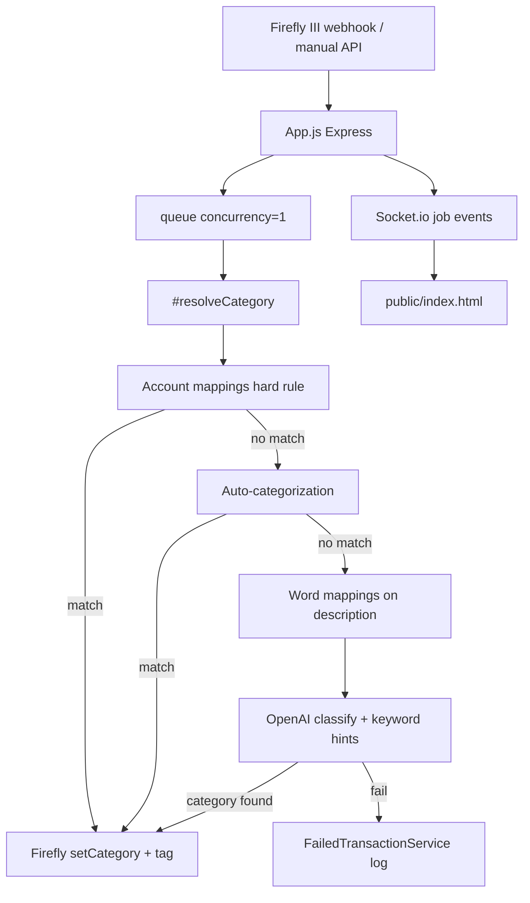

# Codebase Map

> Full analysis pass via `/map-codebase` (2026-06-12). Replaces bootstrap/empty map.

## Purpose

**Firefly III AI Categorizer** — a Node.js service that receives Firefly III webhooks (or manual/batch triggers), runs a prioritized categorization pipeline (account rules → auto-cat → word mappings → OpenAI), and writes categories back to Firefly III. An optional web UI (`ENABLE_UI=true`) provides configuration, bulk processing, transaction management, credit-card statement splitting, and duplicate cleanup.

Fork of [bahuma20/firefly-iii-ai-categorize](https://github.com/bahuma20/firefly-iii-ai-categorize), extended with mapping layers, account/keyword mappings, extraction tools, and **its-magic** engineering workflow overlay (v0.1.2-48).

## Stack

| Aspect | Detail |
|--------|--------|
| Language | JavaScript (ES modules, `"type": "module"`) |
| Runtime | Node.js ≥ 18 (`package.json` engines) |
| HTTP | Express 4.x |
| Real-time | Socket.io 4.x (job/batch progress to UI) |
| Job queue | `queue` npm package (concurrency 1, 30s timeout) |
| AI | OpenAI SDK v3 (`openai`), default model `gpt-4o-mini` (`OPENAI_MODEL`) |
| Persistence | JSON files under `data/` (via `src/storage.js`, overridable with `DATA_DIR`) |
| Frontend | Vanilla HTML/CSS/JS in `public/index.html` (~5.7k lines, no bundler) |
| Container | Multi-stage Alpine Dockerfile; production via parent Firefly stack |
| Dev workflow | its-magic (`.cursor/`, `scripts/`, `docs/engineering/`) |
| CI | GitHub Actions — runbook-driven test/lint (`docs/engineering/runbook.md`) |
| Tests | Runbook points to `tests/run-tests.ps1` (not present in repo; `npm test` is a stub) |

## Repository Layout

```
firefly-iii-ai-categorize/
├── index.js                    # Entry: dotenv → new App().run()
├── src/
│   ├── App.js                  # Monolith: routes, pipeline, batch/webhook handlers (~3.3k LOC)
│   ├── FireflyService.js        # Firefly III REST client (categories, tx CRUD, search)
│   ├── OpenAiService.js         # classify(), matchAccount(), rate-limit stats
│   ├── *MappingService.js       # account / keyword / word mappings (JSON-backed)
│   ├── AutoCategorizationService.js
│   ├── FailedTransactionService.js
│   ├── TransactionExtractionService.js  # CSV/PDF statement split
│   ├── JobList.js               # In-memory jobs + EventEmitter → Socket.io
│   ├── extractionSum.js         # Statement line totals / settlement helpers
│   ├── storage.js              # DATA_DIR resolution + dataFile()
│   └── util.js                 # getConfigVariable() — required env throws
├── public/
│   ├── index.html              # Full admin UI (inline CSS/JS)
│   └── debug.html
├── data/                       # Runtime JSON (created at start; mount in Docker)
├── docs/                       # User guides + engineering artifacts
├── scripts/                    # its-magic Python validators/guards (~20 scripts)
├── .cursor/                    # Agents, commands, hooks, scratchpad
├── its_magic/                  # Framework version pin
├── Dockerfile
├── docker-compose.yml            # DEPRECATED standalone-dev profile (port 3001)
└── env.example / env.docker.example
```

## Entry Points

| Entry | File | Purpose |
|-------|------|---------|
| Process bootstrap | `index.js` | Loads `.env`, instantiates `App`, calls `run()` |
| Application core | `src/App.js` | Express + Socket.io server, all HTTP routes, `#resolveCategory` pipeline |
| Config | `src/util.js` + `.env` | Required: `FIREFLY_URL`, `FIREFLY_PERSONAL_TOKEN`, `OPENAI_API_KEY` |
| Data root | `src/storage.js` | Resolvess writable `data/` (or `DATA_DIR`) |
| Web UI | `public/index.html` | Served when `ENABLE_UI=true` at `/` |
| Webhook | `POST /webhook` | Firefly III automation trigger |
| Health | `GET /` | Returns `"OK"` (Docker HEALTHCHECK) |
| API version | `GET /api/version` | `API_VERSION` constant (currently `1.1.0`) |

## Architecture

### High-level flow



### Categorization precedence (`#resolveCategory`)

1. **Account → category mappings** — hard 1:1; skips AI (`AccountCategoryMappingService`)
2. **Auto-categorization** — foreign/travel heuristics (`AutoCategorizationService`)
3. **Word mappings** — text replacement on description/destination (`WordMappingService`)
4. **OpenAI** — with optional keyword→category hints (`CategoryMappingService.getAiHint`)

Shared by webhook, bulk jobs, and test webhook. Deposits optionally skipped via general settings.

### Service layer

| Module | Responsibility | Persistence |
|--------|----------------|-------------|
| `FireflyService` | REST to Firefly III v1 API | — |
| `OpenAiService` | Prompt + JSON response parsing, backoff on 429 | — |
| `WordMappingService` | Pre-AI text substitution | `data/word-mappings.json` |
| `CategoryMappingService` | Keyword hints for AI (not direct assign) | `data/category-mappings.json` |
| `AccountCategoryMappingService` | Hard account rules | `data/account-category-mappings.json` |
| `AutoCategorizationService` | Foreign/travel rules | `data/auto-categorization-config.json` |
| `FailedTransactionService` | Failed attempt log, enrich from Firefly | `data/failed-transactions.json` |
| `TransactionExtractionService` | Credit-card CSV/PDF split | `data/extraction-config.json` |
| `JobList` | In-memory job/batch state | Ephemeral (lost on restart) |

### HTTP surface (grouped)

- **Core:** `/webhook`, `/api/process-uncategorized`, `/api/process-all`, `/api/test-webhook`
- **Batch control:** `/api/batch-jobs/:id/{pause,resume,cancel}`
- **Mappings:** `/api/word-mappings`, `/api/category-mappings`, `/api/account-category-mappings`
- **Auto-cat:** `/api/auto-categorization/*`
- **Failed tx:** `/api/failed-transactions/*`, `/api/version`
- **Transactions:** `/api/transactions/*`, `/api/categories`, `/api/accounts`, `/api/tags`
- **Duplicates:** `/api/duplicates/*`
- **Extraction:** `/api/extraction/*` (multer upload, batch confirm/revert)

### Frontend

Single-page admin UI in `public/index.html`: side panel navigation, Socket.io client for live job progress, fetch calls to REST API. No separate frontend build step; UI changes require browser hard refresh; backend changes require container rebuild/restart.

### Deployment topology

| Mode | How | Port | Notes |
|------|-----|------|-------|
| **Production (canonical)** | Parent stack: `cd /workdir/firefly && docker compose up -d categorizer` | 3000 | Traefik: `categorizer.omniflow.cc` |
| Standalone dev | `docker compose --profile standalone-dev up -d` | 3001 | `docker-compose.yml` marked DEPRECATED |
| Local dev | `npm install && npm start` / `npm run dev` (nodemon) | `PORT` env | |

Dockerfile: Node 18 Alpine, non-root `nodeuser` (uid 1001), dumb-init, health check on `/`.

## its-magic Overlay

Engineering workflow framework co-located with the app (not a runtime dependency):

- **Agents/commands:** `.cursor/agents/*.mdc`, `.cursor/commands/*.md`
- **Validation scripts:** `scripts/*.py` (doc profile, readme coverage, intake guards, codebase map materializer)
- **Artifacts:** `docs/engineering/*`, `sprints/`, `handoffs/`, `decisions/`
- **CI:** `.github/workflows/ci.yml` reads `TEST_COMMAND` etc. from runbook
- **Scratchpad:** `.cursor/scratchpad.md` — automation flags (`AUTO_FLOW_MODE`, `TOKEN_PROFILE`, …)

Product docs (`docs/*.md` guides) vs engineering docs (`docs/engineering/`) are intentionally split.

## Key Modules (by size / risk)

| File | LOC (approx) | Notes |
|------|---------------|-------|
| `src/App.js` | 3316 | God object: all routes + business logic; primary change hotspot |
| `public/index.html` | 5791 | Monolithic UI; high coupling to API shapes |
| `src/FireflyService.js` | 852 | Pagination, tx mutations, duplicate search |
| `src/TransactionExtractionService.js` | 893 | PDF/CSV parsing, Firefly child tx creation |
| `src/OpenAiService.js` | 282 | Model selection, prompt contracts |

## Conventions

- **ES modules** throughout; private fields `#` on classes.
- **Config:** `getConfigVariable(name, default?)` — missing required vars throw `MissingEnvVariableException`.
- **Errors:** Custom exceptions (`FireflyException`, `WebhookException`) in service/App layers.
- **Logging:** `console.info/warn/error` with emoji prefixes in hot paths.
- **API responses:** JSON `{ success, ... }` pattern on management endpoints.
- **Idempotency:** Queue serializes webhook work; batch jobs support pause/resume/cancel flags in `JobList`.
- **Versioning:** `API_VERSION` in `App.js` bumped when API semantics change (e.g. failed-tx enrich).
- **Data files:** JSON arrays/objects loaded at service init; CRUD via service methods.
- **No TypeScript, no linter config** in repo root; no automated unit tests shipped.
- **German comments** appear in older paths (e.g. `OpenAiService`); English dominates README/docs.

## External Integrations

| System | Integration | Data exchanged |
|--------|-------------|----------------|
| Firefly III | REST `api/v1/*`, PAT auth | Categories, transactions, tags, accounts |
| OpenAI | Chat completions via SDK v3 | Description, payee, category list (privacy-sensitive) |

## Known gaps / sharp edges

- **`src/App.js` monolith** — hard to test or split; most features touch one file.
- **In-memory jobs** — restart clears webhook/batch job history (failed-tx file persists).
- **Tests missing** — runbook references PowerShell test script not in tree; CI may skip or fail until configured.
- **Standalone docker-compose deprecated** — production path is parent Firefly compose.
- **Legacy doc drift** — `docs/CODEBASE_ANALYSIS.md` references older GPT-3.5 model; code uses `gpt-4o-mini`.
- **Product/engineering placeholders** — `docs/product/vision.md`, `docs/engineering/architecture.md` are templates awaiting `/architecture`.

## Related docs

- User/feature guides: `docs/*.md`, `README.md`
- Prior analysis (partially stale): `docs/CODEBASE_ANALYSIS.md`
- Runbook / CI: `docs/engineering/runbook.md`
- Bootstrap materializer: `scripts/materialize_codebase_map.py`
